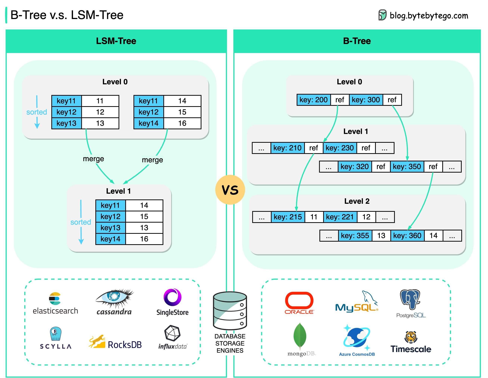

# Database notes
A database is an organized collection of data stored and accessed electronically.
- https://en.wikipedia.org/wiki/Database
- https://en.wikipedia.org/wiki/Database_model
- https://en.wikipedia.org/wiki/Query_language

DB-ENGINES: Knowledge Base of Relational and NoSQL Database Management Systems
- https://db-engines.com/en/ranking

## 原理
- https://github.com/pingcap/awesome-database-learning
- How Does a Database Work? https://cstack.github.io/db_tutorial/

Books
- Readings in Database Systems
  - http://www.redbook.io
  - https://book.douban.com/subject/2256069
- 数据库系统概念 https://book.douban.com/subject/35501216

## 重要概念
- Database schema: https://en.wikipedia.org/wiki/Database_schema
  - https://database.guide/what-is-a-database-schema/
  - https://stackoverflow.com/questions/298739/what-is-the-difference-between-a-schema-and-a-table-and-a-database
  - https://www.huaweicloud.com/zhishi/smart-18531930.html
- Write-ahead logging: https://en.wikipedia.org/wiki/Write-ahead_logging
- Lock
  - File locking: https://en.wikipedia.org/wiki/File_locking
  - Record Locking: https://en.wikipedia.org/wiki/Record_locking
- Query Optimizer
  - 当我谈查询优化器时，我谈些什么 (1)—— IR 设计 https://zhuanlan.zhihu.com/p/680046526
- SQL Commands | DDL, DQL, DML, DCL and TCL Commands https://www.geeksforgeeks.org/sql-ddl-dql-dml-dcl-tcl-commands/

## 数据结构
- Data Structures That Power Your Databases. Which one should we pick? https://twitter.com/bytebytego/status/1685164186681413632

B-Tree
- https://en.wikipedia.org/wiki/B-tree
- https://en.wikipedia.org/wiki/B+_tree

LSM Tree
- https://en.wikipedia.org/wiki/Log-structured_merge-tree
- LSM 算法的原理是什么？https://www.zhihu.com/question/19887265
- 深入理解什么是LSM-Tree https://mp.weixin.qq.com/s/UqpnHs7g5XZcQWDRXiyKyQ
- LSM 日志结构合并树 https://juejin.cn/post/6931342483788070920

B-Tree vs LSM-Tree
- https://tikv.org/deep-dive/key-value-engine/b-tree-vs-lsm/

## Relational database
- https://en.wikipedia.org/wiki/Relational_database
- https://en.wikipedia.org/wiki/Relational_model
- https://en.wikipedia.org/wiki/SQL

### 特点
- 关系型数据库的典型实现主要被调整用于执行规模小而读写频繁，或者大批量读而极少写访问的事务。

### 范式
数据库规范化，是数据库设计的一系列原理和技术，以减少数据库中数据冗余，增进数据的一致性。
- 第一范式
  - https://en.wikipedia.org/wiki/First_normal_form
  - https://zh.wikipedia.org/wiki/第一范式
  - 第一范式是为了要排除重复组的出现，要求数据库的每一列的论域都是由不可分割的原子值组成；每个字段的值都只能是单一值。
- 第二范式
  - https://en.wikipedia.org/wiki/Second_normal_form
  - https://zh.wikipedia.org/wiki/第二范式
  - 要求资料表里的所有资料都要和该资料表的键（主键与候选键）有完全依赖关系：每个非键属性必须独立于任意一个候选键的任意一部分属性。如果有哪些资料只和一个键的一部分有关的话，就得把它们独立出来变成另一个资料表。
  - 一个资料表符合第二范式当且仅当
    - 它符合第一范式
    - 所有非键字段都不能是候选键非全体字段的函数（检查资料表里的每个字段，确认它们是不是都和关键词完全相关， 这样才能知道这个资料表是不是符合第二范式； 如果不是的话，就把那些不完全相关的字段独立出一个资料表。）
- 第三范式
  - https://en.wikipedia.org/wiki/Third_normal_form
  - https://zh.wikipedia.org/wiki/第三范式
  - 要求所有非主键属性都只和候选键有相关性，也就是说非主键属性之间应该是独立无关的。（确保所有不是键的字段都和彼此没有依赖关系）
现在数据库设计最多满足3NF，普遍认为范式过高，虽然具有对数据关系更好的约束性，但也导致数据关系表增加而令数据库IO更易繁忙，原来交由数据库处理的关系约束现更多在数据库使用程序中完成。

参考
- https://en.wikipedia.org/wiki/Database_normalization
- https://zh.wikipedia.org/wiki/数据库规范化
- 数据库第一二三范式到底在说什么？https://zhuanlan.zhihu.com/p/20028672
- 如何理解关系型数据库的常见设计范式？https://www.zhihu.com/question/24696366
- MySQL数据库设计三大范式 https://cloud.tencent.com/developer/article/1753218

### MySQL

### MariaDB
- https://mariadb.com

### TiDB
- https://github.com/pingcap/tidb
- https://docs.pingcap.com/zh/tidb/stable
- https://cn.pingcap.com
- https://asktug.com

同步
- TiDB 作为 MySQL Slave 实现实时数据同步 https://cn.pingcap.com/blog/tidb-as-mysql-slave/
- TIDB作为mysql的从库使用 https://developer.aliyun.com/article/697764
- Migrate MySQL-Compatible Databases to TiDB Cloud Using Data Migration https://docs.pingcap.com/tidbcloud/migrate-from-mysql-using-data-migration
- Migrate Large Datasets from MySQL to TiDB https://github.com/pingcap/docs/blob/master/migrate-large-mysql-to-tidb.md

### Postgres

### SQLite
- https://www.sqlite.org
- https://sqlite.org/docs.html
- https://sqlite.org/cli.html

### CockroachDB
- https://github.com/cockroachdb/cockroach
- https://www.cockroachlabs.com
- 开源分布式NewSQL数据库CockroachDB架构及最佳实践 http://www.postgres.cn/downfiles/pgconf_2018/PostgresChina2018_%E8%B5%96%E5%AE%9D%E5%8D%8E_%E5%BC%80%E6%BA%90%E5%88%86%E5%B8%83%E5%BC%8FNewSQL%E6%95%B0%E6%8D%AE%E5%BA%93CockroachDB%E6%9E%B6%E6%9E%84%E5%8F%8A%E6%9C%80%E4%BD%B3%E5%AE%9E%E8%B7%B5.pdf
- CockroachDB在金融领域最佳实践&思考 https://itdks.su.bcebos.com/a58b2fd35f694f01bf0fa10443ce682d.pdf

### Snowflake
- https://www.snowflake.com/en/
- 当今第一独角兽 Snowflake https://1o24bbs.com/t/snowflake/23466
- Snowflake：数据仓库的终极形态？https://zhuanlan.zhihu.com/p/54439354

## NoSQL
- https://en.wikipedia.org/wiki/NoSQL

优点
- The data structures used by NoSQL databases (e.g. key–value pair, wide column, graph, or document) are different from those used by default in relational databases, making some operations faster in NoSQL.
- The data structures used by NoSQL databases are also viewed as "more flexible" than relational database tables.

特点
- A NoSQL database provides a mechanism for storage and retrieval of data that is modeled in means other than the tabular relations used in relational databases.
- Many NoSQL stores compromise consistency (in the sense of the CAP theorem) in favor of availability, partition tolerance, and speed.
- Most NoSQL databases offer a concept of "eventual consistency", in which database changes are propagated to all nodes "eventually" (typically within milliseconds), so queries for data might not return updated data immediately or might result in reading data that is not accurate, a problem known as stale read.

缺点
- lack of ability to perform ad hoc joins across tables.
- lack of standardized interfaces.
- huge previous investments in existing relational databases.
- Most NoSQL stores lack true ACID transactions, although a few databases have made them central to their designs.

### Redis
Key-value cache

### MongoDB
Document store

### HBase
Wide-column store
