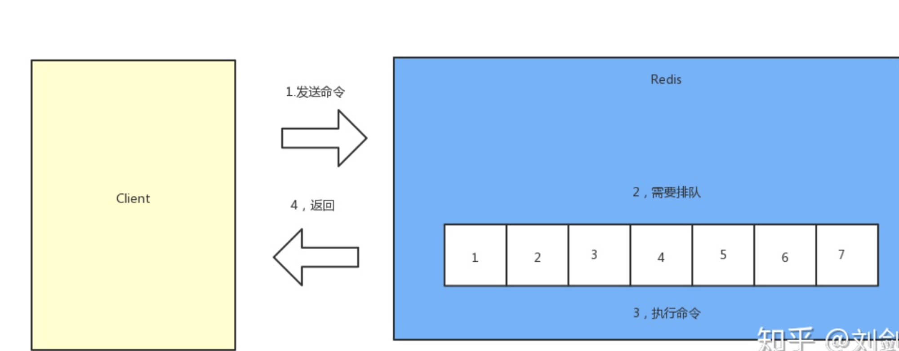

# 高级功能

## 慢查询
### 生命周期

两点说明：

1. 慢查询发生在第3执行命令阶段
2. 客户端超时不一定慢查询，但慢查询是客户端超时的一个可能原因

### 慢查询配置

默认值

config get slowlog-max-len = 128

config get slowlog-log-slower-than = 10000

修改配置文件重启（非首次不建议）

动态配置

config set slowlog-max-len 1000

config set slowlog-log-slower-than 1000

### 慢查询命令

slowlog get 获取慢查询队列

slowlog len 获取慢查询队列长度

slowlog reset 清空慢查询队列

### 运维

1. slowlog-max-len 不要设置过大，默认10ms，通常设置1ms
2. slowlog-log-slower-than 不要设置过大，通常设置1000左右（慢查询队列长度）
3. 理解命令生命周期
4. 定期持久化慢查询

## 发布订阅
https://www.redis.com.cn/redis-pub-sub.html

### 角色

发布者

订阅者

频道

!https://s3-us-west-2.amazonaws.com/secure.notion-static.com/c5f62ac4-47df-41b4-a576-476b7d3100ee/Untitled.png

### API

publish channel message

subscribe [channel] 订阅一个或多个

unsubscribe [channel] 取消订阅一个或多个

## pipeline
### 概念

n个命令操作 = n次网络时间 + n次命令时间

1次pipeline(n条命令) = 1次网络时间 + n次命令时间

注意点

1. redis的命令时间是微秒级别
2. pipeline每次条数要控制（网络）

### 使用建议

1. 注意每次pipeline携带数据量
2. pipeline每次只能作用在一个redis节点上
3. redis原生M命令操作与pipeline区别
    
    M命令：原子操作，子命令排队有序连续执行
    
    pipeline：非原子，有序非连续，中间可能夹杂着其他命令

## 其他功能
- bitmap位图
- hyperloglog
- geo
