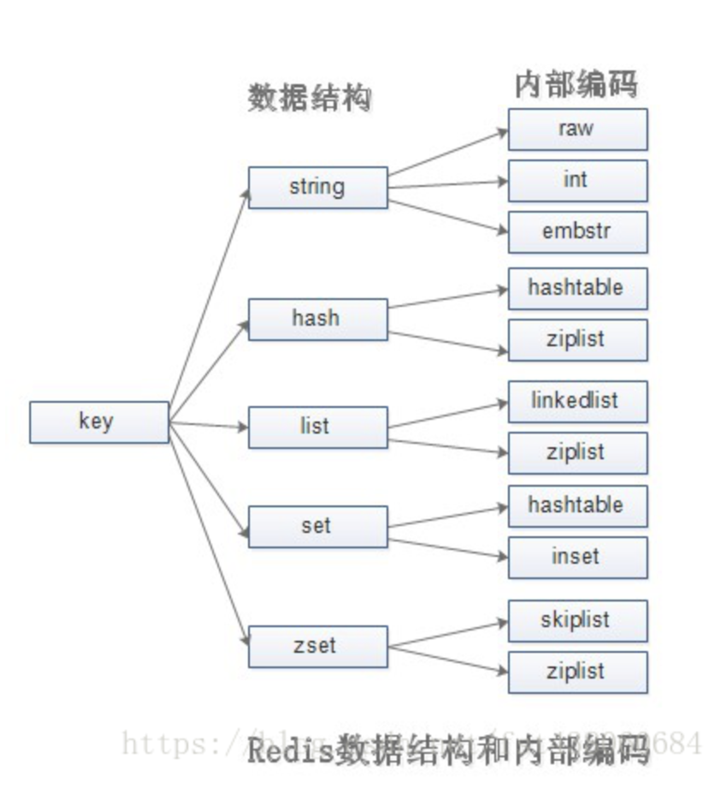

# Redis data types

## string 字符串
### 使用场景

缓存

分布式锁

计数器

### API

get

set

del

incr 单线程无竞争

decr

incrby

decrby

set 不管key是否存在，都设置

setnx key不存在，才设置（分布式锁）

setxx key存在，才设置

mget 等于多次get，减少网络请求

getset 设置key新值并返回旧值

append 将value追加到旧的value

strlen

## hash 表
### API

hget

hset

hdel

hexists

hlen

hmget

hmset

hgetall

hvals

hkeys

## list 列表
### API

lpush

rpush

lpop

rpop

llen

lset

lrange

lindex

lrem

linsert

ltrim

### 特点

有序

可以重复

### 常用

lpush + lpop = stack

lpush + rpop = queue

## set 集合
### 特点

无序

无重复

element

集合间操作

### API

sadd

srem

spop 从集合中弹出

scard 计算集合大小

sismember 判断元素是否在集合中

srandmember 从集合随机挑元素

smembers 获取集合所有元素（无序）

sdiff

sinter

sunion

## zset 有序集合
zadd key score member
zincrby key increment member

zrange key start stop [WITHSCORES]
zrangebyscore key min max [WITHSCORES]
zrevrange key start stop [WITHSCORES]
zrevrangebyscore key max min [WITHSCORES]
zrank key member
zrevrank key member

根据score由小到大取top10数据
zrange key -inf inf byscore limit 0 10 [WITHSCORES]

zcard key
zcount key min max

zscore key member
zmscore key member [member ...]

zrem key member [member ...]
zremrangebyrank key start stop
zremrangebyscore key min max

zmpop numkeys key [key ...] MIN|MAX
zpopmax key
zpopmin key

zrangestore dst src min max

### 特点

无重复元素

有序

element + score

### API

zadd key score element 添加score和element （O(logN)）

zrem key element 删除元素（O1）

zsocre key element 返回元素的分数

zincrby 增加或减少元素的分数

zcard key 返回元素的个数

zrank(zrevrank) 获取元素排名（从小到大）

zrange(zrevrange) key 遍历（O(logN + M)）

zrangebyscore(zrevrangebyscore) 返回指定分数范围内的升序元素（O(logN + M)）

zcount 返回有序集合指定分数范围的元素个数（O(logN + M)）

zremrangebyrank 删除指定排名内的升序元素（O(logN + M)）

zremrangebyscore 删除指定分数内的升序元素（O(logN + M)）
