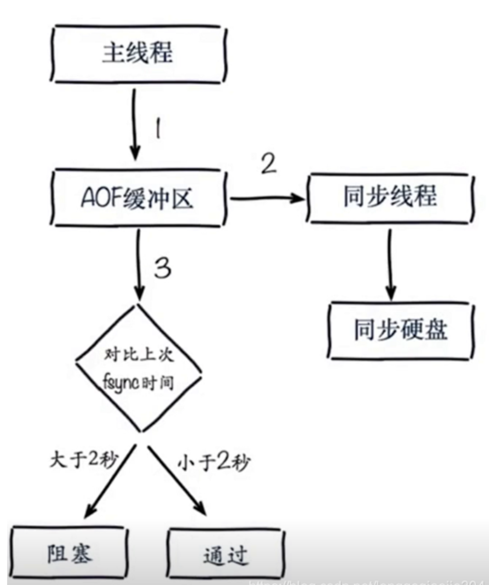

# 持久化

启动 redis-server 时只要指定了 redis.conf 文件，则具体配置需要参照指定的 redis.conf 文件来，而不是按照默认配置

1.RDB模式

默认开启

指定 rdb 文件位置

dbfilename dump.rdb

dir /usr/local/var/db/redis/

使用 redis-server 启动 redis-server 则 dump.rdb 默认保存在当前目录

使用 sudo redis-server 启动则 dump.rdb 默认保存在 redis.conf 中 dir 所对应的目录

手动持久化命令 save 和 bgsave

2.AOF模式

默认不开启，需要在 redis.conf 中开启，默认保存在 redis.conf 中 dir 所对应的目录

appendonly yes

appendonly.aof

3.都开启情况下两者数据持久化会有交互同步，但同步方式还不太清楚

### RDB最佳策略

集中管理

主从、从开（主从）

### AOF最佳策略

AOF重写集中管理

everysec

### 最佳策略

小分片

缓存或者存储

监控（内存、硬盘、网络、负载）

足够的内存

## RDB 与 AOF
对比
| 命令  | RDB | AOF |
|---|---|---|
| 启动优先级| 低  | 高  |
| 体积  | 小  | 大  |
| 恢复速度  | 快  | 慢  |
| 数据安全性  | 丢数据  | 根据策略决定 |
| 轻重  | 重  | 轻  |

## 持久化运维
### fork操作和改善

### 子进程开销和优化

1. CPU
    
    开销：RDB和AOF文件生成，属于CPU密集型
    
    优化：不做CPU绑定，不和CPU密集型部署
    
2. 内存
    
    开销：fork内存开销，copy-on-write
    
    优化：
    
3. 硬盘
    
    开销：AOF和RDB文件写入，可以结合iostat, iotop分析
    
    优化：
    
    不要和高硬盘负载服务部署在一起：存储服务、消息队列等
    
    no-appendfsync-on-rewrite = yes （不阻塞，先写缓冲区，然后刷磁盘）
    
    根据写入量决定磁盘类型：例如ssd
    
    单机多实例持久化文件目录可以考虑分盘
    

### no-appendfsync-on-rewrite参数

redis提供了两种持久化机制，rdb和aof。

关于aof的原理，类似于预写日志，不再解释。其中几个选项如下：

appendfsync always：总是写入aof文件，并完成磁盘同步appendfsync everysec：每一秒写入aof文件，并完成磁盘同步

appendfsync no：写入aof文件，不等待磁盘同步。

可见，从持久化角度讲，always是最安全的。从效率上讲，no是最快的。而redis默认设置进行了折中，选择了everysec。合情合理。

bgrewriteaof机制，在一个子进程中进行aof的重写，从而不阻塞主进程对其余命令的处理，同时解决了aof文件过大问题。

现在问题出现了，同时在执行bgrewriteaof操作和主进程写aof文件的操作，两者都会操作磁盘，而bgrewriteaof往往会涉及大量磁盘操作，这样就会造成主进程在写aof文件的时候出现阻塞的情形，现在no-appendfsync-on-rewrite参数出场了。如果该参数设置为no，是最安全的方式，不会丢失数据，但是要忍受阻塞的问题。如果设置为yes呢？这就相当于将appendfsync设置为no，这说明并没有执行磁盘操作，只是写入了缓冲区，因此这样并不会造成阻塞（因为没有竞争磁盘），但是如果这个时候redis挂掉，就会丢失数据。丢失多少数据呢？在linux的操作系统的默认设置下，最多会丢失30s的数据。

因此，如果应用系统无法忍受延迟，而可以容忍少量的数据丢失，则设置为yes。如果应用系统无法忍受数据丢失，则设置为no。

### AOF追加阻塞

如果AOF文件fsync同步时间大于2s，Redis主进程就会阻塞；

如果AOF文件fsync同步时间小于2s，Redis主进程就会返回；

其实这样做的目的是为了保证文件安全性的一种策略。

AOF追加阻塞会产生两位问题：

（1）fsync大于2s时候，会阻塞redis主进程，我们都知道redis主进程是用来执行redis命令的，是不能阻塞的。

（2）虽然每秒everysec刷盘策略，但是实际上不是丢失1s数据，实际有可能丢失2s数据。

AOF阻塞定位

（1）通过Redis日志定位

（2）通过Redis命令定位

> info persistence

（3）通过Linux命令top定位

Cpu(s): %wa指CPU等待磁盘写入完成的时间，可以表明磁盘IO负载情况
