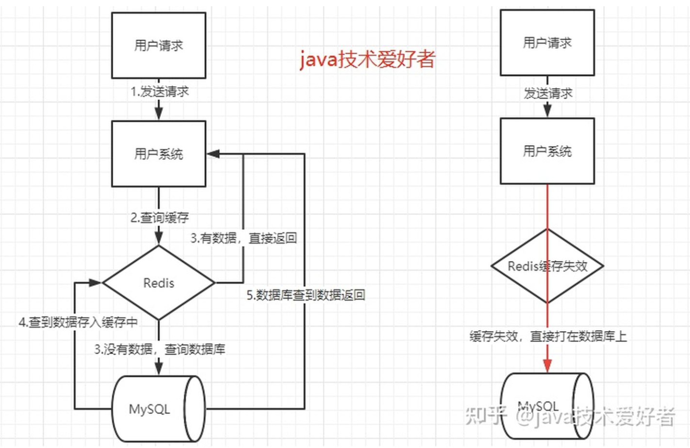
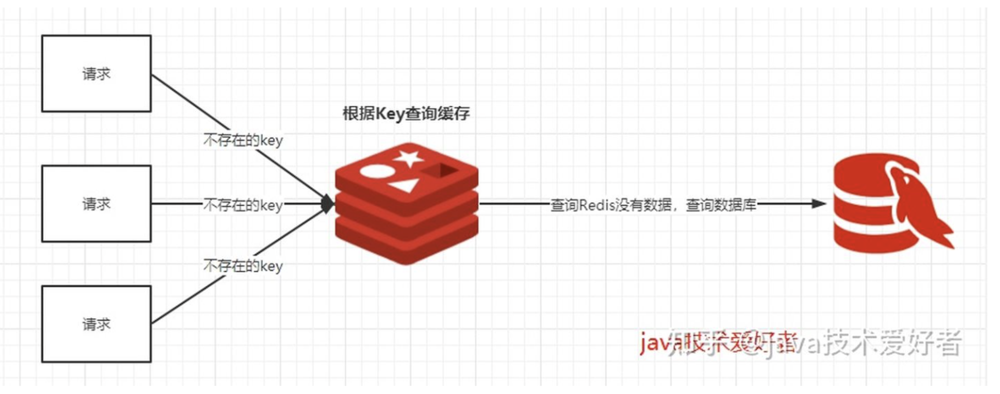
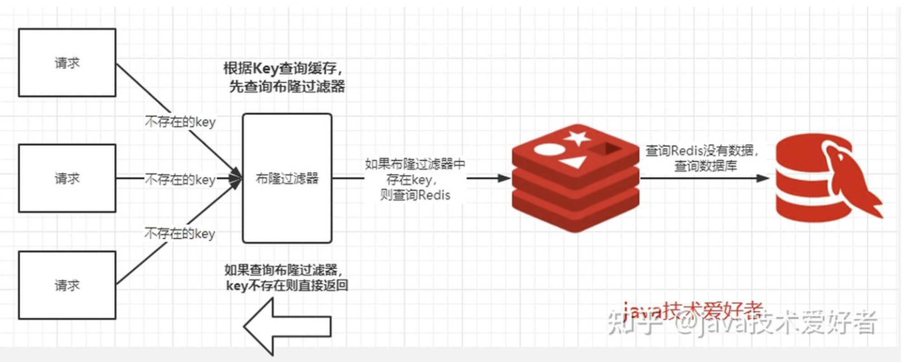

# Redis interview

## 缓存设计与优化
### 受益和成本

受益

1. 加速读写
2. 降低后端负载：MySQL负载

成本

1. 数据不一致：更新策略
2. 代码维护成本：多了一层逻辑
3. 运维成本：Redis集群

使用场景

1. 降低后端负载
    
    对高消耗SQL：join结果集/分组统计结果缓存
    
2. 加速请求响应
    
    利用Redis优化IO响应时间
    
3. 大量写合并为批量写
    
    如计数器先Redis累加再写DB
    

### 缓存的更新策略

1. LRU/LFU/FIFO 算法剔除：例如maxmemory-policy
2. 超时剔除：例如expire
3. 主动更新：开发控制生命周期

对比
| 策略  | 一致性  | 维护成本  |
|---|---|---|
| LRU/LIRS 算法剔除  | 最差  | 低  |
| 超时剔除  | 较差  | 低  |
| 主动更新  | 强  | 高  |

建议

1. 低一致性：最大内存和淘汰策略
2. 高一致性：超时剔除和主动更新结合，最大内存和淘汰策略兜底

参考

https://en.wikipedia.org/wiki/Cache_replacement_policies

### 缓存粒度控制

三个角度

1. 通用性：全量属性更好
2. 占用空间：部分属性更好
3. 代码维护：表面上全量属性更好

### 缓存穿透问题

如何发现

1. 业务的响应时间
2. 业务本身问题
3. 相关指标：总调用数、缓存层命中数、存储层命中数

解决办法

1. 缓存空对象
2. 布隆过滤器

### 无底洞问题

集群机器增加到一定数量，m操作花的时间可能会越来越长

优化IO的方法

1. 命令本身优化：例如慢查询keys、hgetall bigkey
2. 减少网络通信次数
3. 降低接入成本：例如客户端长链接/连接池、NIO等

四种批量优化的方法

1. 串行mget
2. 串行io
3. 并行io
4. hash_tag

### 热点key的重建优化

问题：热点key + 较长的重建时间

三个目标

1. 减少重缓存的次数
2. 数据尽可能一致
3. 减少潜在危险

两个解决

1. 互斥锁（mutex key）
    
    优点：思路简单、保持一致性
    
    缺点：代码复杂度增加、存在死锁的风险
    
2. 永远不过期
    
    优点：基本杜绝热点key重建问题
    
    缺点：不保证一致性、逻辑过期时间增加维护成本和内存成本

## 经典面试题
### 一、缓存雪崩

**什么是缓存雪崩？**

当某一个时刻出现大规模的缓存失效的情况，那么就会导致大量的请求直接打在数据库上面，导致数据库压力巨大，如果在高并发的情况下，可能瞬间就会导致数据库宕机。这时候如果运维马上又重启数据库，马上又会有新的流量把数据库打死。这就是缓存雪崩。

**分析：**

造成缓存雪崩的关键在于在同一时间大规模的key失效。为什么会出现这个问题呢，有几种可能，第一种可能是Redis宕机，第二种可能是采用了相同的过期时间。搞清楚原因之后，那么有什么解决方案呢？

**解决方案：**

1、在原有的失效时间上加上一个随机值，比如1-5分钟随机。这样就避免了因为采用相同的过期时间导致的缓存雪崩。

如果真的发生了缓存雪崩，有没有什么兜底的措施？

2、使用熔断机制。当流量到达一定的阈值时，就直接返回“系统拥挤”之类的提示，防止过多的请求打在数据库上。至少能保证一部分用户是可以正常使用，其他用户多刷新几次也能得到结果。

3、提高数据库的容灾能力，可以使用分库分表，读写分离的策略。

4、为了防止Redis宕机导致缓存雪崩的问题，可以搭建Redis集群，提高Redis的容灾性。

### 二、缓存击穿

**什么是缓存击穿？**

其实跟缓存雪崩有点类似，缓存雪崩是大规模的key失效，而缓存击穿是一个热点的Key，有大并发集中对其进行访问，突然间这个Key失效了，导致大并发全部打在数据库上，导致数据库压力剧增。这种现象就叫做缓存击穿。

**分析：**

关键在于某个热点的key失效了，导致大并发集中打在数据库上。所以要从两个方面解决，第一是否可以考虑热点key不设置过期时间，第二是否可以考虑降低打在数据库上的请求数量。

**解决方案：**

1、上面说过了，如果业务允许的话，对于热点的key可以设置永不过期的key。

2、使用互斥锁。如果缓存失效的情况，只有拿到锁才可以查询数据库，降低了在同一时刻打在数据库上的请求，防止数据库打死。当然这样会导致系统的性能变差。

### 三、缓存穿透

**什么是缓存穿透？**

我们使用Redis大部分情况都是通过Key查询对应的值，假如发送的请求传进来的key是不存在Redis中的，那么就查不到缓存，查不到缓存就会去数据库查询。假如有大量这样的请求，这些请求像“穿透”了缓存一样直接打在数据库上，这种现象就叫做缓存穿透。

**分析：**

关键在于在Redis查不到key值，这和缓存击穿有根本的区别，区别在于**缓存穿透的情况是传进来的key在Redis中是不存在的**。假如有黑客传进大量的不存在的key，那么大量的请求打在数据库上是很致命的问题，所以在日常开发中要对参数做好校验，一些非法的参数，不可能存在的key就直接返回错误提示，要对调用方保持这种“不信任”的心态。

**解决方案：**

1、**把无效的Key存进Redis中**。如果Redis查不到数据，数据库也查不到，我们把这个Key值保存进Redis，设置value="null"，当下次再通过这个Key查询时就不需要再查询数据库。这种处理方式肯定是有问题的，假如传进来的这个不存在的Key值每次都是随机的，那存进Redis也没有意义。

2、**使用布隆过滤器**。布隆过滤器的作用是某个 key 不存在，那么就一定不存在，它说某个 key 存在，那么很大可能是存在(存在一定的误判率)。于是我们可以在缓存之前再加一层布隆过滤器，在查询的时候先去布隆过滤器查询 key 是否存在，如果不存在就直接返回。

PS：布隆过滤器

[https://zh.wikipedia.org/wiki/布隆过滤器](https://zh.wikipedia.org/wiki/%E5%B8%83%E9%9A%86%E8%BF%87%E6%BB%A4%E5%99%A8)

https://en.wikipedia.org/wiki/Bloom_filter

https://llimllib.github.io/bloomfilter-tutorial/

https://zhuanlan.zhihu.com/p/43263751

https://www.eecs.harvard.edu/~michaelm/postscripts/tr-02-05.pdf

### 例题一、Redis大量key瞬间同时失效都去查db

1. 意思就是，缓存不可用了，如何防止大流量冲击db。在没有托底方案的前提下，用户访问直接打向默认页面或返回默认信息，此时必须同时起一个任务去批量刷入缓存，让一部分用户先用起来，总之不能让大流量冲击db。后续改进方案，预设多级缓存

2. 多种手段并用，回答起来可能更效果更好

1) 不同key设置不同的失效时间

2) 多级缓存，比如jvm层面的缓存

3) 对于热点数据，可以用定时任务定期查询后put到缓存中

3. 缓存穿透和雪崩是俩回事，这个是雪崩

第一是根据压测结果评估数据库能扛得住的流量然后进行限流

第二是有定时刷新机制来更新缓存尽快保证缓存可用

第三过期时间加随机值可以尽量降低雪崩的可能性

还有就是可以引入多级缓存
