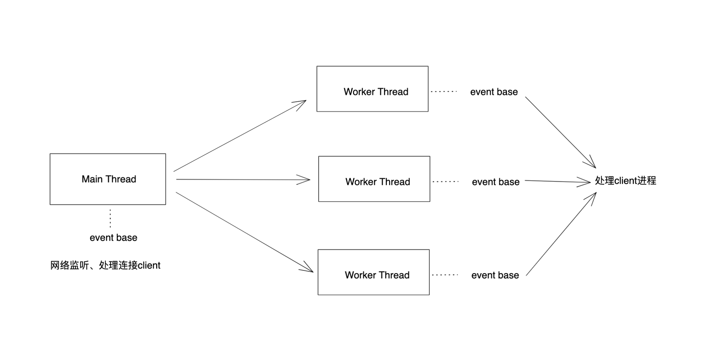

# Redis network

## 网络模型
### 网络模型介绍

1. 事件处理模型
    - Reactor
    - Proactor
2. 并发模式
    - 多进程
    - 多线程

### Redis 网络模型

redis-server 单线程（避免切换）

自己封装的、不用 libevent

- select、epoll (Linux)
- evpoll (solaris)
- kqueue (BSD、MacOS）

### Memcached 网络模型

Memcached 

→  libevent （事件处理、IO多路复用）

→ Reactor 模型（事件处理模型）

→ 支持

→ 非阻塞式IO

→ IO复用（Select和Poll）

多线程 + libevent （每个线程都维护自己的事件循环）

### Redis 和 Memcached 的区别
1. 性能
    
    差不多
    
2. 持久化
    
    Memcached: 不支持
    
    Redis：两种方式支持 RDB、AOF
    
3. 数据结构
    
    Memcached：k-v
    
    Redis：String、List、Hash、Set、Sorted Set
    
4. 附加功能
    
    Memcached：多线程服务器
    
    Redis：
    
    - 发布订阅
    - 主从复制（只支持主从复制，不支持主主复制）
    - 事务支持（与传统事务不同，当一个客户端中的事务完成后，才能执行其他客户端）
        
        Multi + Exec
        
    - Lua 脚本
