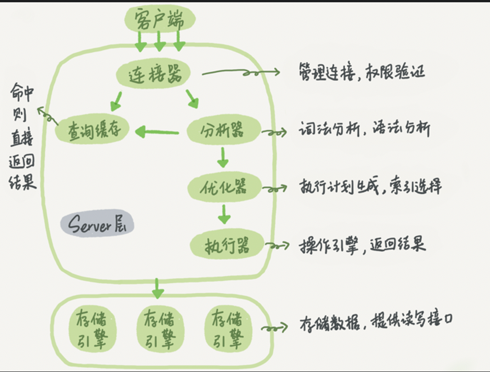

# MySQL 架构

## 高性能MySQL阅读笔记

### 第一章 MySQL 架构与历史

### 1.1 逻辑架构

MySQL服务器逻辑架构图-三层逻辑

- 连接层
- 服务器层
- 储存引擎层



```

客户端

| | |

连接/线程处理

| |

查询缓存 <- 解析器 (语法解析)

|

优化器 (表关联顺序和索引选择)

| | |

储存引擎

```

PS

- 客户端每次连接，服务端都会创建一个线程，连接会有缓存，连接的查询会在单个线程中进行。

### 1.2 并发控制

读写锁

- 共享锁（读锁）
- 拍他锁（写锁）

锁策略和锁粒度（提高共享资源的并发性）

- 表锁（开销小）例子：邮箱例子
- 行锁（开销大 innodb）
- 

### 1.3 事务

例子：银行应用

事务的ACID概念

- 原子性 atomicity
- 一致性 consistency
- 隔离性 isolation（隔离级别）
- 持久性 durability

隔离级别

- READ UNCOMMITTED（未提交读）脏读
- READ COMMITTED（提交读、不可重复读）
- REPEATABLE READ（可重复读）解决脏读，出现幻读（innodb通过多版本并非控制mvvc解决幻读）
- SERIALIZABLE（可串行化）解决幻读

隔离级别 | 脏读可能性 | 不可重复读可能性 | 幻读可能性 | 加锁读

- -- | --- | --- | --- | ---

READ UNCOMMITTED | Yes | Yes | Yes | No

READ COMMITTED | No | Yes | Yes | No

REPEATABLE READ | No | No | Yes | No

SERIALIZABLE | No | No | No | Yes

死锁

InnoDb 处理死锁方式：

将持有最少行级排他锁的事务进行回滚（死锁回滚算法）

事务日志

预写式方式，慢慢的刷到磁盘，崩溃可恢复数据

MySQL中的事务（InnoDB为例）

- 自动提交 (AUTOCOMMIT)

`SHOW VARIABLES LIKE 'AUTOCOMMIT';`

`SET AUTOCOMMIT = 1;`

当 AUTOCOMMIT = 0 时，所有的查询都是在一个事务中，直到显式的执行 COMMIT 提交或 ROLLBACK 回滚

- 一些命令会强制执行 COMMIT 提交当前的活动事务

`ALTER TABLE`

`LOCK TABLE`

- 事务隔离级别

新的隔离级别会在下一个事务开始时生效

`SET SESSION TRANSACTION ISOLATION LEVEL READ COMMITTED;`

事务中混用储存引擎

不可靠

隐式和显式锁定

InnoDB 采用的是两阶段锁定协议

- 隐式锁定（Inno根据隔离级别自动加锁）

在事务执行的过程中，随时都可以执行锁定，锁只在执行 COMMIT 或者 ROLLBACK 的时候释放，并且所有锁是在同一时刻释放

- 显式锁定

`SELECT ... LOCK IN SHARE MODE`

`SELECT ... FOR UPDATE`

- MySQL 支持 LOCK TABLES 和 UNLOCK TABLE，但最好不要使用，让服务器自己管理

行级锁的一个变种，提升并发性能（避免加锁，实现非阻塞读）。

MVCC的实现，是通过保存数据在某个时间的快照来实现的。也就是说，不管需要执行多长时间，每个事务看到的数据都是一致的。根据事务的开始时间不同，每个事务对同一张表，同一时刻看到的数据可能是不一样的。

不同储存引擎的MVCC实现是不同的

- 乐观（optimistic）并发控制
- 悲观（pessimistic）并发控制

InnoDB 的 MVCC 如何工作

通过在每行记录后面保存两个隐藏的列来实现的。这两个列，一个保存了行的创建时间，一个保存了行的过期时间（或删除时间）。当然存储的并不是实际的时间值，而是系统版本号（system version number)。每开始一个新的事务，系统版本号就会自动递增。事务开始时刻的版本号会作为事务的版本号，用来和查询到的每行记录的版本号进行比较。

InnoDB 在 REPEATABLE READ 隔离级别下，MVCC 具体操作

- SELECT ...
- INSERT ...
- DELETE ...
- UPDATE ...

优缺点

- 使大多数操作都可以不用加锁，这样设计使读数据更简单，性能很好，并且也能保证只会读取到符合标准的行。
- 不足之处是每行记录都需要额外的储存空间，需要做更多的行检查工作，以及额外维护工作。

作用范围

MVCC 只在 REPEATABLE READ 和 READ COMMITTED 两个隔离级别下工作。其他两个隔离级别和 MVCC 不兼容，因为 READ UNCOMMITTED 总是读取最新的行，而不符合当前事务版本的数据行。而 SERIALIZABLE 则会对所有读取的行都加锁
