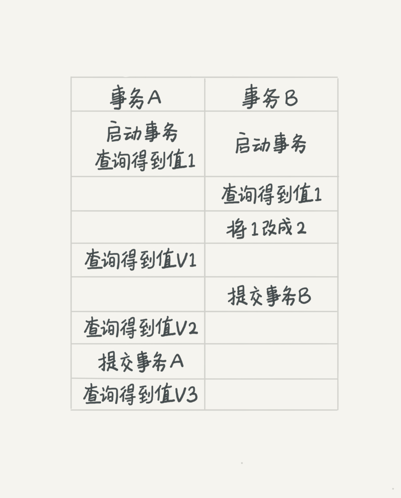

## Transaction Isolation Levels
- https://dev.mysql.com/doc/refman/8.0/en/innodb-transaction-isolation-levels.html

### 简介

查看当前事务隔离级别

show variables like 'transaction_isolation';

隔离性与隔离级别提到事务，你肯定会想到 

ACID（Atomicity、Consistency、Isolation、Durability，即原子性、一致性、隔离性、持久性）

### 隔离性

当数据库上有多个事务同时执行的时候，就可能出现

- 脏读（dirty read）
- 不可重复读（non-repeatable read）
- 幻读（phantom read）

等问题，为了解决这些问题，就有了“隔离级别”的概念。

在谈隔离级别之前，你首先要知道，你隔离得越严实，效率就会越低。因此很多时候，我们都要在二者之间寻找一个平衡点。SQL 标准的事务隔离级别包括：

- 读未提交（read uncommitted）是指，一个事务还没提交时，它做的变更就能被别的事务看到。
- 读提交（read committed）是指，一个事务提交之后，它做的变更才会被其他事务看到。
- 可重复读（repeatable read）是指，一个事务执行过程中看到的数据，总是跟这个事务在启动时看到的数据是一致的。当然在可重复读隔离级别下，未提交变更对其他事务也是不可见的。
- 串行化（serializable ）顾名思义是对于同一行记录，“写”会加“写锁”，“读”会加“读锁”。当出现读写锁冲突的时候，后访问的事务必须等前一个事务执行完成，才能继续执行。

其中“读提交”和“可重复读”比较难理解，所以我用一个例子说明这几种隔离级别。假设数据表 T 中只有一列，其中一行的值为 1，下面是按照时间顺序执行两个事务的行为。

在不同的隔离级别下，事务 A 会有哪些不同的返回结果，也就是图里面 V1、V2、V3 的返回值分别是什么。

- 若隔离级别是“读未提交”， 则 V1 的值就是 2。这时候事务 B 虽然还没有提交，但是结果已经被 A 看到了。因此，V2、V3 也都是 2。
- 若隔离级别是“读提交”，则 V1 是 1，V2 的值是 2。事务 B 的更新在提交后才能被 A 看到。所以， V3 的值也是 2。
- 若隔离级别是“可重复读”，则 V1、V2 是 1，V3 是 2。之所以 V2 还是 1，遵循的就是这个要求：事务在执行期间看到的数据前后必须是一致的。
- 若隔离级别是“串行化”，则在事务 B 执行“将 1 改成 2”的时候，会被锁住。直到事务 A 提交后，事务 B 才可以继续执行。所以从 A 的角度看， V1、V2 值是 1，V3 的值是 2。

### 常见问题

1、事务的特性：原子性、一致性、隔离性、持久性

2、多事务同时执行的时候，可能会出现的问题：脏读、不可重复读、幻读

3、事务隔离级别：读未提交、读提交、可重复读、串行化

4、不同事务隔离级别的区别：读未提交：一个事务还未提交，它所做的变更就可以被别的事务看到读提交：一个事务提交之后，它所做的变更才可以被别的事务看到可重复读：一个事务执行过程中看到的数据是一致的。未提交的更改对其他事务是不可见的串行化：对应一个记录会加读写锁，出现冲突的时候，后访问的事务必须等前一个事务执行完成才能继续执行

5、配置方法：启动参数transaction-isolation

6、事务隔离的实现：每条记录在更新的时候都会同时记录一条回滚操作。同一条记录在系统中可以存在多个版本，这就是数据库的多版本并发控制（MVCC）。

7、回滚日志什么时候删除？系统会判断当没有事务需要用到这些回滚日志的时候，回滚日志会被删除。8、什么时候不需要了？当系统里么有比这个回滚日志更早的read-view的时候。9、为什么尽量不要使用长事务。长事务意味着系统里面会存在很老的事务视图，在这个事务提交之前，回滚记录都要保留，这会导致大量占用存储空间。除此之外，长事务还占用锁资源，可能会拖垮库。10、事务启动方式：一、显式启动事务语句，begin或者start transaction,提交commit，回滚rollback；二、set autocommit=0，该命令会把这个线程的自动提交关掉。这样只要执行一个select语句，事务就启动，并不会自动提交，直到主动执行commit或rollback或断开连接。11、建议使用方法一，如果考虑多一次交互问题，可以使用commit work and chain语法。在autocommit=1的情况下用begin显式启动事务，如果执行commit则提交事务。如果执行commit work and chain则提交事务并自动启动下一个事务。思考题：在开发过程中，尽可能的减小事务范围，少用长事务，如果无法避免，保证逻辑日志空间足够用，并且支持动态日志空间增长。监控Innodb_trx表，发现长事务报警。疑问：关于第二节的思考题，读题干的意思，是在什么场景下，一天一备比一周一备更有优势。老师的答案只是给出了一天一备的优势，那么适用场景怎么理解呢？

作者回复: 总结得非常好👍🏿第二讲问题，其实备份是强需求，至于多少合适，还是得平衡业务需求和存储成本

为该讲总结了几个问题, 大家复习的时候可以先尝试回答这些问题检查自己的掌握程度:

1.事务的概念是什么?

2.mysql的事务隔离级别读未提交, 读已提交, 可重复读, 串行各是什么意思?

3.读已提交, 可重复读是怎么通过视图构建实现的?

4.可重复读的使用场景举例? 对账的时候应该很有用?

5.事务隔离是怎么通过read-view(读视图)实现的?

6.并发版本控制(MCVV)的概念是什么, 是怎么实现的?

7.使用长事务的弊病? 为什么使用常事务可能拖垮整个库?

8.事务的启动方式有哪几种?

9.commit work and chain的语法是做什么用的?

10.怎么查询各个表中的长事务?11.

如何避免长事务的出现?
