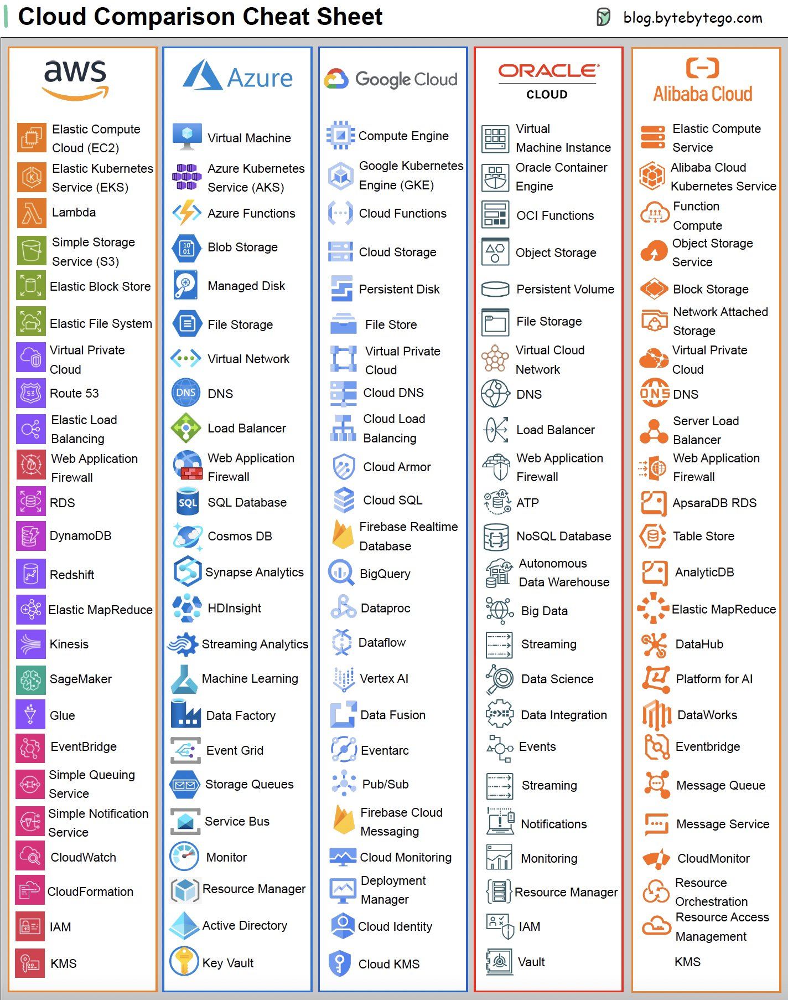

# Cloud

## Ali Cloud
- https://www.alibabacloud.com
- https://console.aliyun.com
- dns https://dns.console.aliyun.com/#/dns/domainList
- ecs https://help.aliyun.com/zh/ecs/
- sms https://help.aliyun.com/zh/sms/

## Tencent Cloud
- https://cloud.tencent.com
- https://console.cloud.tencent.com/
  - 我的域名 - 域名注册 - 控制台 https://console.cloud.tencent.com/domain
  - 我的备案 - 网站备案 - 控制台 https://console.cloud.tencent.com/beian

## AWS
- https://aws.amazon.com
- https://aws.amazon.com/cn/getting-started/
- Console https://console.aws.amazon.com/console/home

Products
- EC2 https://aws.amazon.com/ec2/
  - Troubleshooting https://docs.aws.amazon.com/zh_cn/AWSEC2/latest/UserGuide/TroubleshootingInstances.html
- Lightsail https://aws.amazon.com/lightsail/
- CloudFormation https://aws.amazon.com/cloudformation/

SDK
- https://aws.amazon.com/sdk-for-go/

## Azure
- https://azure.microsoft.com/en-us/
- https://azure.microsoft.com/en-us/get-started

SDK
- https://github.com/Azure/azure-sdk-for-go

## GCP
- https://cloud.google.com
- https://cloud.google.com/docs/get-started
- Console https://console.cloud.google.com
- GKE https://cloud.google.com/kubernetes-engine/docs
- https://cloud.google.com/go

SDK
- https://github.com/googleapis
- https://github.com/googleapis/google-api-go-client
- https://github.com/googleapis/google-cloud-go

Samples
- https://github.com/GoogleCloudPlatform/golang-samples
- https://github.com/GoogleCloudPlatform/python-docs-samples
- https://github.com/GoogleCloudPlatform/microservices-demo
- https://github.com/GoogleCloudPlatform/kubernetes-engine-samples
- https://github.com/GoogleCloudPlatform/generative-ai

## OCI(Oracel Cloud Infrastructure)
- https://www.oracle.com/cloud/
- https://www.oracle.com/cloud/free/
- https://developer.oracle.com/free.html

