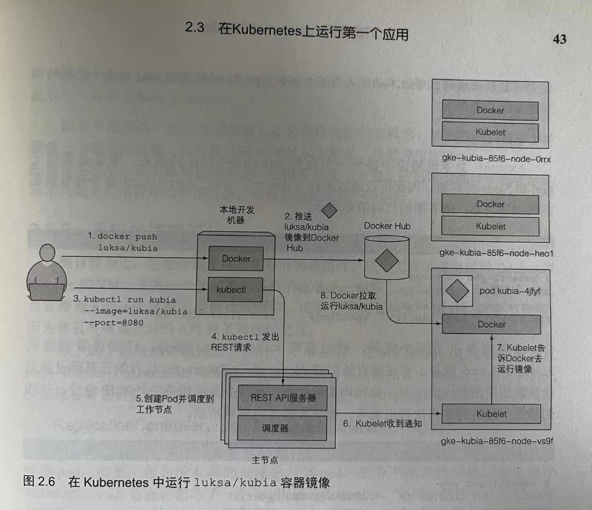

## kubectl
- https://kubernetes.io/docs/reference/kubectl/
- https://kubernetes.io/docs/reference/kubectl/quick-reference/

### kubectl 客户端工具
- cheatsheet https://pbs.twimg.com/media/GfGHszPaQAAVtMk?format=png&name=4096x4096

安装

brew install kubernetes-cli

查看版本

kubectl version

展示集群信息

kubectl cluster-info

查看节点

kubectl get nodes

kubectl get nodes -o wide

查看pod

kubectl get pods

kubectl get pods -o wide

查看服务

kubectl get services

查看ReplicationController、ReplicaSet

kubectl get rc

kubectl get rs

### Pod

不能列出单个容器，因为它们不是独立的 Kubernetes 对象，但是可以列出 pod。

创建pod

kubectl create -f example.yaml

获取pod详细信息

kubectl get po your_pod_name -o yaml

pod端口与宿主机端口映射 pod_port:host_port

kubectl port-forward your_pod_name 8888:8080

### 信息获取

kubectl get nodes

kubectl get pods [pod-name]

kubectl get rc(replicationcontroller)

kubectl get namespace

kubectl get deployments [app-name]

kubectl get services [service-name]

命令查询解释

kubectl explain pods

kubectl explain pods.spec

### 问题排查

kubectl logs

kubectl logs your_pod_name

kubectl logs your_pod_name -c container_name_in_pod

kubectl describe deployments hello-world

kubectl describe pods hello-world

kubectl describe services xxx

kubectl describe replicasets

### 操作

kubectl expose deployment hello-world --type=LoadBalancer --name=my-service
