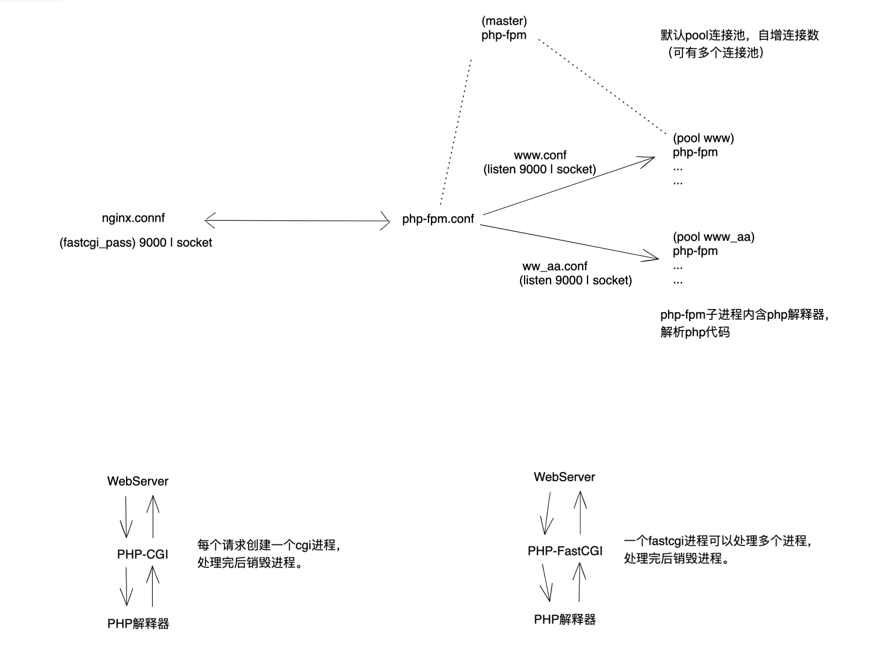

# Nginx 
- https://nginx.org

Tool
- NGINX configuration generator
  - https://github.com/digitalocean/nginxconfig.io
  - https://www.digitalocean.com/community/tools/nginx
- Nginx Proxy Manager
  - https://github.com/NginxProxyManager/nginx-proxy-manager
  - https://nginxproxymanager.com
- nginx-proxy
  - https://github.com/nginx-proxy/nginx-proxy

Best Practice
- Nginx开发从入门到精通 https://github.com/taobao/nginx-book

## 原理

1. 架构
    
    master 
    
    - worker
    - worker
2. Nginx 信号量
    
    nginx 进程通过 singal 来管理子进程
    
    使用方法例子
    
    kill -信号量 nginx进程号
    
    - TERM、INT 暴力重启 quick shutdown
    - HUP 优雅的重启，操作完之后再关闭重启、且改了配置文件后不必重启 nginx
    - USR1 用于 nginx 日志管理备份，修改日志文件指向（备份日志，让日志重新写入一个新文件）
    - USR2 平滑的升级（不需要关闭 nginx）
    - WINCH 优雅的关闭进程（配合 USR2 来升级）
3. Nginx 和 PHP 的架构
- 
