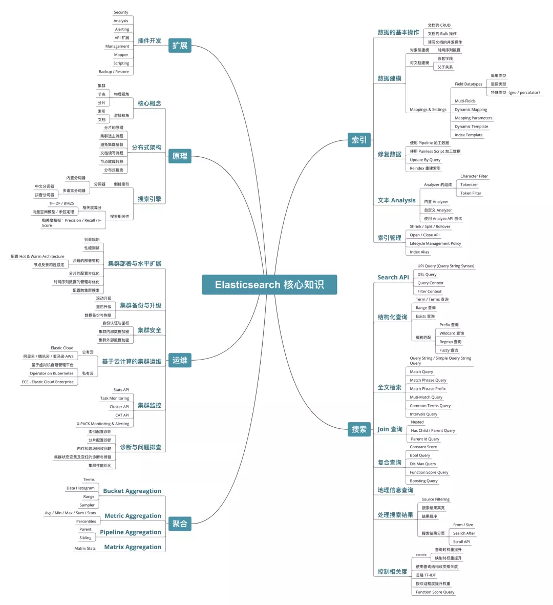

# ElasticSearch

## 基本概念

### 索引

- 正向索引
    
    ID → 内容
    
- 倒排索引（反向索引）
    
    词汇 → 在文档中的位置
    
    解释：被用来存储在全文搜索下某个单词在一个文档或者一组文档中的存储位置的映射。它是文档检索系统中最常用的数据结构。

## 基本使用

### Docker 安装
docker 节点集群
- https://www.elastic.co/guide/en/elasticsearch/reference/current/docker.html
- https://gist.github.com/markheath/f246ec3aa5a3e7493991904e241a416a

docker 单节点
- https://medium.com/@TimvanBaarsen/how-to-run-an-elasticsearch-7-x-single-node-cluster-for-local-development-using-docker-compose-2b7ab73d8b82

### 本地集群

在开发机上运行多个 Elasticsearch 实例

`elasticsearch -E node.name=node0 -E cluster.name=geektime -E path.data=node0_data -d`

`elasticsearch -E node.name=node1 -E cluster.name=geektime -E path.data=node1_data -d`

`elasticsearch -E node.name=node2 -E cluster.name=geektime -E path.data=node2_data -d`

`elasticsearch -E node.name=node3 -E cluster.name=geektime -E path.data=node3_data -d`

查看集群节点

[http://localhost:9200/_cat/nodes](http://localhost:9200/_cat/nodes)

## 命令行工具

启动 Elasticsearch

`elasticsearch`

查看

http://localhost:9200/

查看插件

`elasticsearch-plugin list`

安装插件

`elasticsearch-plugin install analysis-icu`

## GUI 工具
### cerebro
Github
- https://github.com/lmenezes/cerebro

介绍
- web admin 管理工具

入口
- http://localhost:9000/

Ref
- https://www.redhat.com/sysadmin/cerebro-webui-elk-cluster

### dejavu
Github
- https://github.com/appbaseio/dejavu/

介绍
- web ui 工具
