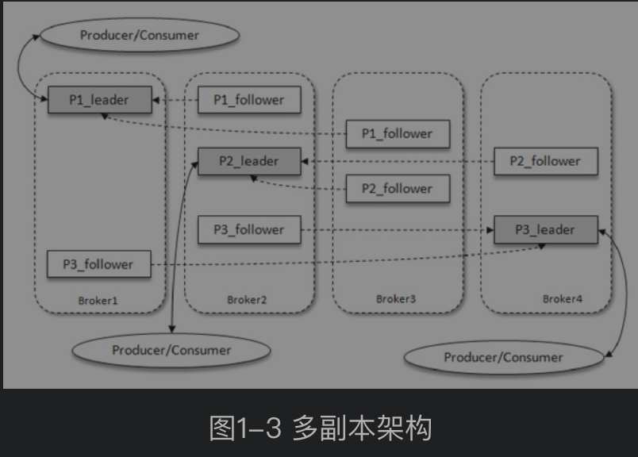

# Kafka
- https://kafka.apache.org
- https://kafka.apache.org/documentation/
- https://github.com/apache/kafka

Docs
- https://cwiki.apache.org/confluence/display/KAFKA
- https://cwiki.apache.org/confluence/display/KAFKA/Clients

参考
- 这些年背过的面试题——Kafka篇 https://mp.weixin.qq.com/s/8UNtMIllJ03ULZwE9WtVdg
- 我用kafka两年踩过的一些非比寻常的坑（宝贵经验）https://mp.weixin.qq.com/s/zP2qDnLpteuTIhbdPuIxKQ
- Kafka 高可靠高性能原理探究 https://mp.weixin.qq.com/s/_g11mmmQse6KrkUE8x4abQ
- Kafka 分级存储在腾讯云的实践与演进 https://mp.weixin.qq.com/s/bjXStdwAb5BRwKfquOHT_w
- B站KAFKA探索与实践 https://mp.weixin.qq.com/s/IQ2h_iwg8esXuH_jG1St_w
- 基于SSD的Kafka应用层缓存架构设计与实现 https://tech.meituan.com/2021/01/14/kafka-ssd.html
- Kafka 痛点专题｜AutoMQ 如何解决 Kafka 冷读副作用 https://mp.weixin.qq.com/s/RX9Z54906lzQ2WDo2MvwxA
- Kafka消费组 https://www.cnblogs.com/huxi2b/p/6223228.html
- kafka-docker https://github.com/wurstmeister/kafka-docker

最佳实践
- go-zero微服务实战系列（八、如何处理每秒上万次的下单请求）https://mp.weixin.qq.com/s/OAbuzj876SrrcB5WO_2FuA
- go-zero微服务实战系列（九、极致优化秒杀性能）https://mp.weixin.qq.com/s/8VSS9WNSy4jkOSSIA4BmLw
- Kafka 核心技术与实战 https://time.geekbang.org/column/article/98683

## 原理
顺序读写
- 为什么说磁盘顺序读写大于内存随机读写？https://www.zhihu.com/question/328982776
- 如何利用磁盘顺序读写快于内存随机读写这一现象？https://www.zhihu.com/question/48794778

### 一、基本概念

1. 体系架构
    
    Producer 生产者
    
    Consumer 消费者
    
    Broker 服务器节点（多个节点可组成一个集群）
    
2. 消息存储
    
    主题 Topic
    
    分区 Partition
    

### 二、生产者

客户端开发：消息发送步骤、必要参数配置、发送模式、拦截器、序列化、分区器

### 三、消费者

1. 消费者与消费组
2. 客户端开发：消费步骤、必要的参数配置、订阅主题和分区、消息消费、位移提交、控制或关闭消费、指定位移消费、再均衡、拦截器、多线程实现

### 四、主题与分区

1. 主题的管理
    
    创建、分区副本的分配、查看、修改、配置管理、删除
    
2. KafkaAdminClient
    
    KafkaAdminClient可实现以调用API的方式对Kafka进行管理
    
3. 分区的管理
    
    优先副本、分区重分配、复制限流、修改副本因子
    

PS：如何选择合适的分区数：性能测试工具、分区数和吞吐量的关系、考量因素

其他概念

1. Kafka 消息有序，但 Topic 不有序，Partition 有序
2. 分区副本
    
    leader 副本、follower 副本，以及 leader 选举
    
3. 优先副本
4. 分区重分配

### 五、配置

- Broker级配置（重点 `broker.id`` listeners` `advertised.listeners`` log.dirs` `zookeeper.connect`）
- Topic级配置 （通过 --config 选项来配置）
- Producer配置 （通过实现kafka接口来配置）
- Consumer配置（通过实现kafka接口来配置）
- Kafka连接配置
- Kafka流配置
- AdminClient配置

### 六、集群
Tool
- https://github.com/yahoo/CMAK

不同节点对应不同的参数配置 server.properties

重要参数

- broker.id
- listeners
- advertised.listeners
- log.dirs

### 七、工具

[CMAK](https://github.com/yahoo/CMAK) 是一个kafka集群管理工具 [编译后的CMAK](https://blog.wolfogre.com/posts/kafka-manager-download/)

使用方法：

配置：conf/application.conf

启动（默认9000端口）：./bin/cmak > cmak.out 2>&1 &

指定端口：bin/cmak -Dconfig.file=/path/to/application.conf -Dhttp.port=9100

## 架构
### Producer

### Consumer

消费者（Consumer）负责订阅Kafka中的主题（Topic），并且从订阅的主题上拉取消息。与其他一些消息中间件不同的是：在Kafka的消费理念中还有一层消费组（Consumer Group）的概念，每个消费者都有一个对应的消费组。当消息发布到主题后，只会被投递给订阅它的每个消费组中的一个消费者。

消费者与消费组这种模型可以让整体的消费能力具备横向伸缩性，我们可以增加（或减少）消费者的个数来提高（或降低）整体的消费能力。对于分区数固定的情况，一味地增加消费者并不会让消费能力一直得到提升，如果消费者过多，出现了消费者的个数大于分区个数的情况，就会有消费者分配不到任何分区。

例子：

某个主题中共有4个分区（Partition）：P0、P1、P2、P3。有两个消费组A和B都订阅了这个主题，消费组A中有4个消费者（C0、C1、C2和C3），消费组B中有2个消费者（C4和C5）。按照Kafka默认的规则，最后的分配结果是消费组A中的每一个消费者分配到1个分区，消费组B中的每一个消费者分配到2个分区，两个消费组之间互不影响。每个消费者只能消费所分配到的分区中的消息。换言之，每一个分区只能被一个消费组中的一个消费者所消费。

Kafka 同时支持两种消息投递模式，而这正是得益于消费者与消费组模型的契合：

如果所有的消费者都隶属于同一个消费组，那么所有的消息都会被均衡地投递给每一个消费者，即每条消息只会被一个消费者处理，这就相当于点对点模式的应用。

如果所有的消费者都隶属于不同的消费组，那么所有的消息都会被广播给所有的消费者，即每条消息会被所有的消费者处理，这就相当于发布/订阅模式的应用。

消费组是一个逻辑上的概念，它将旗下的消费者归为一类，每一个消费者只隶属于一个消费组。每一个消费组都会有一个固定的名称，消费者在进行消费前需要指定其所属消费组的名称，这个可以通过消费者客户端参数group.id来配置，默认值为空字符串。

消费者并非逻辑上的概念，它是实际的应用实例，它可以是一个线程，也可以是一个进程。同一个消费组内的消费者既可以部署在同一台机器上，也可以部署在不同的机器上。

### Broker(Broker Cluster)

服务代理节点。对于Kafka而言，Broker可以简单地看作一个独立的Kafka服务节点或Kafka服务实例。大多数情况下也可以将Broker看作一台Kafka服务器，前提是这台服务器上只部署了一个Kafka实例。一个或多个Broker组成了一个Kafka集群。一般而言，我们更习惯使用首字母小写的broker来表示服务代理节点。

### Topic

Kafka中的消息以主题为单位进行归类，生产者负责将消息发送到特定的主题（发送到Kafka集群中的每一条消息都要指定一个主题），而消费者负责订阅主题并进行消费。

### Topic Partition

主题是一个逻辑上的概念，它还可以细分为多个分区，一个分区只属于单个主题，很多时候也会把分区称为主题分区（Topic-Partition）。

同一主题下的不同分区包含的消息是不同的，分区在存储层面可以看作一个可追加的日志（Log）文件，消息在被追加到分区日志文件的时候都会分配一个特定的偏移量（offset）。

offset是消息在分区中的唯一标识，Kafka通过它来保证消息在分区内的顺序性，不过offset并不跨越分区，也就是说，Kafka保证的是分区有序而不是主题有序。

每一条消息被发送到broker之前，会根据分区规则选择存储到哪个具体的分区。如果分区规则设定得合理，所有的消息都可以均匀地分配到不同的分区中。

如果一个主题只对应一个文件，那么这个文件所在的机器 I/O 将会成为这个主题的性能瓶颈，而分区解决了这个问题。

在创建主题的时候可以通过指定的参数来设置分区的个数，当然也可以在主题创建完成之后去修改分区的数量，通过增加分区的数量可以实现水平扩展。

PS: 需进一步理解broker 和 副本因子（副本因子 * 分区数）

例子：主题中有 4 个分区，消息被顺序追加到每个分区日志文件的尾部。Kafka中的分区可以分布在不同的服务器（broker）上，也就是说，一个主题可以横跨多个broker，以此来提供比单个broker更强大的性能。

Kafka 为分区引入了多副本（Replica）机制，通过增加副本数量可以提升容灾能力。同一分区的不同副本中保存的是相同的消息（在同一时刻，副本之间并非完全一样），副本之间是“一主多从”的关系，其中leader副本负责处理读写请求，follower副本只负责与leader副本的消息同步。副本处于不同的broker中，当leader副本出现故障时，从follower副本中重新选举新的leader副本对外提供服务。Kafka通过多副本机制实现了故障的自动转移，当Kafka集群中某个broker失效时仍然能保证服务可用。

如图1-3所示，Kafka集群中有4个broker，某个主题中有3个分区，且副本因子（即副本个数）也为3，如此每个分区便有1个leader副本和2个follower副本。生产者和消费者只与leader副本进行交互，而follower副本只负责消息的同步，很多时候follower副本中的消息相对leader副本而言会有一定的滞后。

