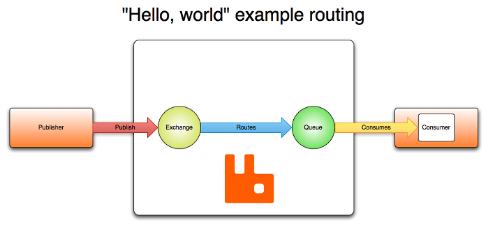
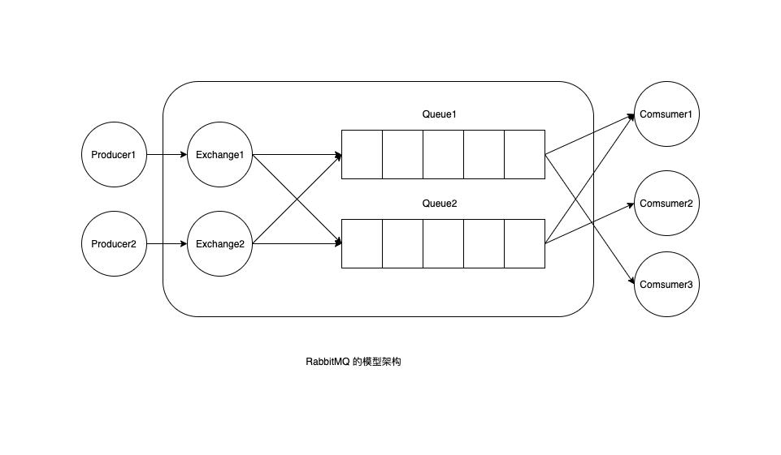

# rabbitmq
- https://www.rabbitmq.com
- https://github.com/rabbitmq/rabbitmq-server

Docs
- https://www.rabbitmq.com/docs
- https://www.rabbitmq.com/tutorials
- https://github.com/rabbitmq/rabbitmq-tutorials

## 原理
- RabbitMQ基本原理 https://www.cnblogs.com/jun-ma/p/4840869.html

### amqp-concepts

[https://www.rabbitmq.com/tutorials/amqp-concepts.html](https://www.rabbitmq.com/tutorials/amqp-concepts.html)

exchange type

- default
    
    **is a direct exchange with no name, every queue that is created is automatically bound to it with a routing key which is the same as the queue name.**
    
- direct
- topic
- headers
- fanout

### Producer

exchange_declare('name', 'type', ...)

basic_publish($obj_msg, 'name')

close

### Consumer

exchange_declare('name', 'type', ...)

queue_declare('queue_name')

queue_bind('queue_name', 'name')

basic_consume('queue_name', ..., callback)

callback

close

### 消费消息

- 推模式 basic_consume（更常用）
- 拉模式 basic_get
- 区别：
    - basic_comsume 将信道（Channel）置为投递模式，直到取消队列的订阅为止。在投递期间，RabbitMQ 会不断地推送消息给消费者，当然推送消息的个数还是会受到 basic-qps 的限制。
    - 如果只想从队列获取单条消息而不是持续订阅，建议还是使用 basic-get 进行消费。但是不能将 basic-get 放在一个循环里来代替 basic-consume，这样做会严重影响 RabbitMQ 的性能。如果要实现高吞吐，消费者理应使用 basic-consume。

## 其他概念

### 笔记

1.complete task

2.多个worker(默认R-R)

3.多个worker(同一个channel)的ACK机制

正在执行任务的worker挂掉，则将未ACK的Message重新发送到其他worker(R-R)

消息忘记ACK，导致吃更多内存

4.message_read、message_unack、queue和message不是很强大（消息仍会丢失），更强大有publisher confirms

5.消息分发策略，默认(R-R)

Connections (一个tcp连接对应多个虚拟channel连接，避免多个生产者、消费者频繁创建tcp连接所消耗的资源)

Channels (为多个线程)

RabbitMQ 模型架构

Exchanges 类型：

- fanout
- direct
- Topic
- headers

Queues：

消息进入到

### 发布订阅 Publish/Subscribe

发布订阅模式：不同基本的发送一条消息到一个指定的 worker，发布订阅是发送一条消息到多个消费者

### 交换机 Exchange

RabbitMQ 中消息模型的核心思想是 producer 绝不直接的发送任何消息给一个 queue，而是生产者只能发送消息到一个 exchange。

exchange 的作用是一边从 producer 接收消息，另一边将消息推送给 queue，至于是要将消息推给某个指定的 queue，或者推给多个 queue，还是将消息丢弃，这则要看 exchange 的类型是怎么定义的。

交换机的类型有：

- direct
- topic
- headers
- fanout 广播一个 exchange 接收到的所有消息这个 exchange 知道的所有 queue

查看命令：

- rabbitmqctl list_exchanges
- rabbitmqctl list_bindings
- rabbitmqctl list_queues

### 临时队列 Temporary queues

为了监听大量的消息，需要做到两点

- 1.连接一个新的 RabbitMQ 需要一个新的且空的 queue，可以创建随机名字的 queue
- 2.一旦一个 consumer 和 queue 断开连接了，那么我们需要删除这个 queue

### 路由 Routing

Routing: exchange 将消息只派发给指定的 queue

Bindings: exchange 和 queue 之间通过 routing_key 和 binding_key 来绑定

direct 类型的 exchange：不同于 fanout 类型，当为 direct 类型时：路由只将设置 routing_key 的消息推给与 queue 的 binding_key 匹配的 queue。

特殊情况当 direct 绑定所有 queue 时，则跟 fanout 类型一样，广播消息到所有 queue

### Topic exchange

比 direct exchange 更为灵活的 routing 策略

## rabbitmq实践

管理页面

[http://localhost:15672/#/](http://localhost:15672/#/)

go类库

[https://github.com/streadway/amqp](https://github.com/streadway/amqp)

[https://pkg.go.dev/github.com/streadway/amqp](https://pkg.go.dev/github.com/streadway/amqp)

教程

[https://github.com/rabbitmq/rabbitmq-tutorials/tree/master/go](https://github.com/rabbitmq/rabbitmq-tutorials/tree/master/go)

[https://www.rabbitmq.com/tutorials/tutorial-one-go.html](https://www.rabbitmq.com/tutorials/tutorial-one-go.html)

[https://www.rabbitmq.com/tutorials/tutorial-two-go.html](https://www.rabbitmq.com/tutorials/tutorial-two-go.html)

## rabbitmq管理工具

### **插件管理**

rabbitmq-plugins list

rabbitmq-plugins enable plugin_name

rabbitmq-plugins disable plugin_name

### **web 管理工具的开启和访问**

rabbitmq-plugins enable rabbitmq_management

[http://localhost:15672](http://localhost:15672/)

### **启动管理**

rabbitmq-server 启动rabbitmq

rabbitmqctl stop 关闭erlang虚拟机和rabbitmq服务

rabbitmqctl shutdown 阻塞关闭

rabbitmqctl stop_app 只关闭rabbitmq服务

rabbitmqctl start_app 开启rabbitmq服务

rabbitmqctl wait 等待rabbitmq启动

rabbitmqctl reset 还原到最初状态

rabbitmqctl force_rest 强制还原

rabbitmqctl force_boot 确保节点可以启动

rabbitmqctl sync_queue queue 指示未同步队列queue的slave镜像可以同步master镜像行的内容

rabbitmqctl cancel_sync_queue queue 取消队列queue同步镜像的操作

### **服务端状态查看**

rabbitmqctl status

rabbitmqctl list_connections

rabbitmqctl list_channels

rabbitmqctl list_exchanges

rabbitmqctl list_queues

rabbitmqctl list_bindings

rabbitmqctl list_consumers

### **python版rabbitmqadmin工具**

./rabbitmqadmin list queues

### **集群管理**

rabbitmqctl cluster_status 显示集群状态

rabbitmqctl join_cluster {cluster_node} 将节点加入指定集群

rabbitmqctl change_cluster_node_type {disc|ram} 修改集群节点类型

rabbitmqctl forget_cluster_node 将节点从集群中删除

rabbitmqctl update_cluster_nodes {clusternode} 更新节点信息
