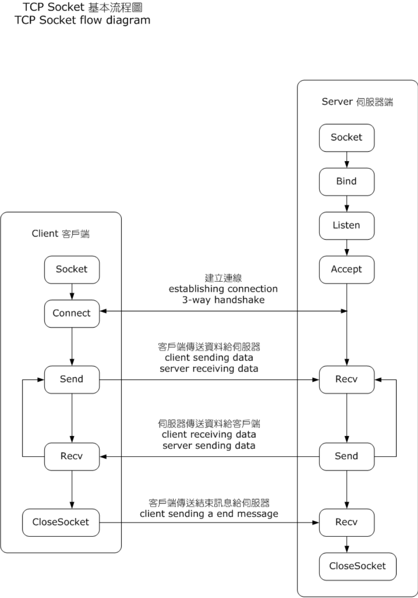

# Socket
- https://en.wikipedia.org/wiki/Berkeley_sockets
- https://zh.wikipedia.org/wiki/Berkeley套接字

Docs
- https://man7.org/linux/man-pages/man2/socket.2.html

Learn
- http://kohala.com
- http://kohala.com/start/
- http://unpbook.com
- http://kohala.com/start/toc.unpv12e.html
- http://www.kohala.com/start/unpv22e/toc.unpv22e.html
- https://github.com/unpbook/unpv13e

介绍
- socket 到底是个啥 https://mp.weixin.qq.com/s/Ebvjy132eRDOmcIL5cmxJw
- Linux Socket编程 https://www.cnblogs.com/skynet/archive/2010/12/12/1903949.html
- socket/io(1)、Linux的socket编程详解 https://blog.csdn.net/hguisu/article/details/7445768
- 事件驱动与协程概念 https://blog.fliaping.com/the-conception-of-event-drive-and-coroutine/
- libevent
  - libevent简介和使用 https://blog.csdn.net/yyyiran/article/details/12219737
  - libevent源码深度剖析一 https://blog.csdn.net/sparkliang/article/details/4957667

Best Practice
- Tinyhttpd https://github.com/EZLippi/Tinyhttpd

## IO模型
- IO - 同步，异步，阻塞，非阻塞 （亡羊补牢篇）https://blog.csdn.net/historyasamirror/article/details/5778378
- 100%弄明白5种IO模型 https://zhuanlan.zhihu.com/p/115912936
- 五种IO模型 https://blog.csdn.net/ZWE7616175/article/details/80591587
- Linux五种IO模型和三种多路复用技术大详解 https://mp.weixin.qq.com/s/26BkzSBHUZTVdgPF8IJRMQ
- Select、poll、Epoll、KQueue区别 https://blog.csdn.net/GJQI12/article/details/105118354
- 异步网络模型 https://tech.youzan.com/yi-bu-wang-luo-mo-xing/
- 基于事件驱动的异步编程 https://juejin.cn/post/6844903449130221582
- 两种高效的服务器设计模型：Reactor和Proactor模型 https://blog.csdn.net/u013074465/article/details/46276967
- 高性能IO之Reactor模式 https://www.cnblogs.com/doit8791/p/7461479.html
- 单线程多路复用和多线程加锁的区别 https://segmentfault.com/q/1010000004026316
- Golang修养之路
  - 流？I/O操作？阻塞？epoll? https://www.yuque.com/aceld/golang/sdgfgu
  - Linux网络Server的N种并发模型 https://www.yuque.com/aceld/golang/pup96w

### 阻塞式IO

### 非阻塞式IO

### IO多路复用（I/O Multiplexing）
- https://zh.wikipedia.org/wiki/多路复用
- I/O多路复用技术（multiplexing）是什么？https://www.zhihu.com/question/28594409
- 什么是IO多路复用，理解IO多路复用 https://blog.csdn.net/wsx199397/article/details/38533239
- 聊聊IO多路复用之select、poll、epoll详解 https://www.jianshu.com/p/dfd940e7fca2
- 9.2 I/O 多路复用：select/poll/epoll https://www.xiaolincoding.com/os/8_network_system/selete_poll_epoll.html
- select、poll、epoll之间的区别总结 https://www.cnblogs.com/Anker/p/3265058.html
- 腾讯
  - 十个问题理解Linux epoll工作原理 https://mp.weixin.qq.com/s/h3CBZt2KEA-ScXFSKHaRBg
  - 深入学习IO多路复用 select/poll/epoll 实现原理 https://mp.weixin.qq.com/s/5xj42JPKG8o5T7hjXIKywg
  - 深入揭秘 epoll 是如何实现 IO 多路复用的 https://mp.weixin.qq.com/s/9vVs2olnfoVEpoJCFWUmMQ

select和poll

epoll
- Linux epoll 之 LT & ET 模式全揭秘 https://strikefreedom.top/archives/linux-epoll-with-level-triggering-and-edge-triggering

kqueue

有点：单个process同时处理多个网络连接的IO

基本原理：select，poll，epoll，kqueue这些函数不断的轮询所负责的所有socket，当某个socket就绪（一般是读就绪或者写就绪），就通知用户进程

`当用户进程调用了select，那么整个进程会被block`，而同时，kernel会“监视”所有select负责的socket，当任何一个socket中的数据准备好了，select就会返回。这个时候用户进程再调用read操作，将数据从kernel拷贝到用户进程。

所以，`I/O 多路复用的特点是通过一种机制一个进程能同时等待多个文件描述符，而这些文件描述符（套接字描述符）其中的任意一个进入读就绪状态，select()函数就可以返回`

### 信号驱动

SIGIO

### 异步IO

POSIX的aio_系列函数

