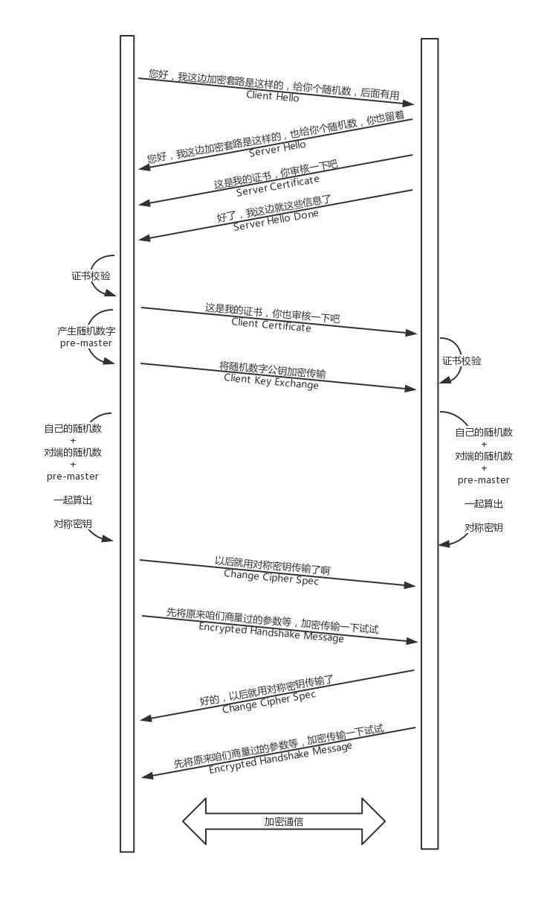
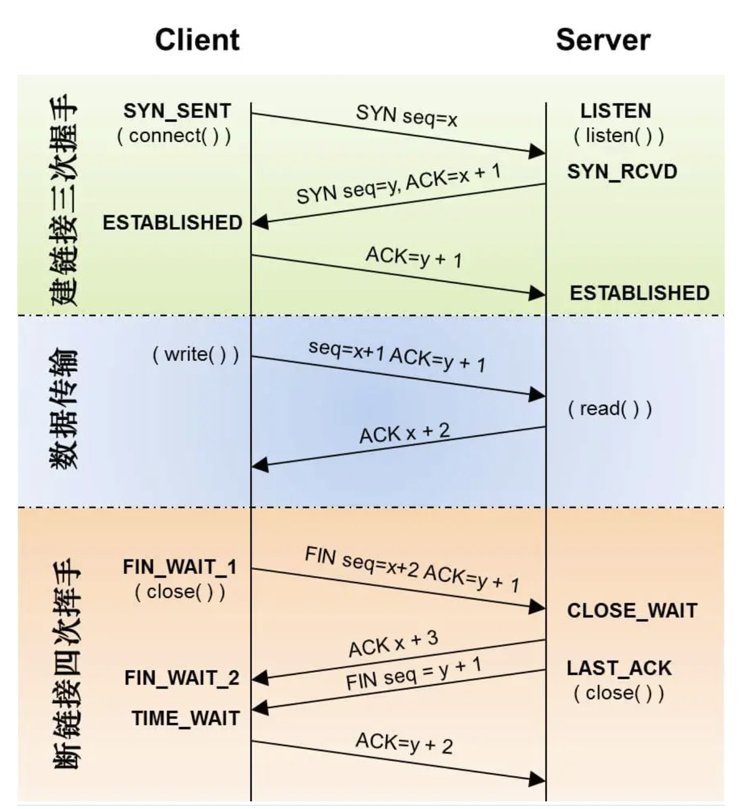

# TCP
- https://zh.wikipedia.org/wiki/传输控制协议
- https://en.wikipedia.org/wiki/Transmission_Control_Protocol
- TCP 协议简介 https://www.ruanyifeng.com/blog/2017/06/tcp-protocol.html
- TCP 的那些事儿（上）https://coolshell.cn/articles/11564.html

## TCP 最佳实践
- 有赞TCP网络编程最佳实践 https://mp.weixin.qq.com/s/5bev2XS1iX41-lY1oOF9SQ
- 通过实验深入了解 TCP 数据的发送和接收 https://mp.weixin.qq.com/s/6MlebbExo3GVhj554J7Vnw

## TCP三次握手和四次挥手
Ref：
- https://www.xiaolincoding.com/network/3_tcp/tcp_interview.html
- 深入理解 Linux 的 TCP 三次握手 https://mp.weixin.qq.com/s/G2LuRZjQE15F6fSU-Bv_jw
- “三次握手，四次挥手”你真的懂吗？https://zhuanlan.zhihu.com/p/53374516
- TCP三次握手四次挥手过程详解 https://blog.csdn.net/imilli/article/details/50620104
- 为什么TCP4次挥手时等待为2MSL？https://www.zhihu.com/question/67013338
- 通过实验深入了解 TCP 连接的建立和关闭 https://mp.weixin.qq.com/s/OpOCIVxKF1xK-HI-E-8uRg
- https://www.cloudflare.com/learning/network-layer/what-is-mtu/
- https://www.cloudflare.com/learning/network-layer/what-is-mss/

## TCP状态码

[https://zh.wikipedia.org/wiki/传输控制协议#状态编码](https://zh.wikipedia.org/wiki/%E4%BC%A0%E8%BE%93%E6%8E%A7%E5%88%B6%E5%8D%8F%E8%AE%AE#%E7%8A%B6%E6%80%81%E7%BC%96%E7%A0%81)

LISTEN

SYN-SEND

SYN-RECEIVED

ESTABLISHED

FIN-WAIT-1

FIN-WAIT-2

CLOSE-WAIT

CLOSING

LAST-ACK

TIME-WAIT
- 从一次经历谈 TIME_WAIT 的那些事 https://coolshell.cn/articles/22263.html
- Linux-TCP/IP TIME_WAIT状态原理 https://www.cnblogs.com/JohnABC/p/5833585.html

CLOSED

### TCP状态转化

### TCP 状态码问题
一条tcp连接，主动关闭的一方不可能出现的连接状态是(A)

A.CLOSE_WAIT

B.FIN_WAIT2

C.TIME_WAIT

D.FIN_WAIT1

TCP链接中主动断开链接netstat观察可能出现的状态流转是（CD）

A.ESTABLISHED->CLOSE_WAIT->TIME_WAIT->CLOSED

B.ESTABLISHED->TIME_WAIT->CLOSE_WAIT->CLOSED

C.ESTABLISHED->FIN_WAIT_1->FIN_WAIT_2->TIME_WAIT->CLOSED

D.ESTABLISHED->FIN_WAIT_1->TIME_WAIT->CLOSED

## TCP报文

[https://zh.wikipedia.org/wiki/传输控制协议#封包結構](https://zh.wikipedia.org/wiki/%E4%BC%A0%E8%BE%93%E6%8E%A7%E5%88%B6%E5%8D%8F%E8%AE%AE#%E5%B0%81%E5%8C%85%E7%B5%90%E6%A7%8B)

## 滑动窗口

## 超时重传

## TCP设计问题

**【问题1】为什么连接的时候是三次握手，关闭的时候却是四次握手？**

答：因为当Server端收到Client端的SYN连接请求报文后，可以直接发送SYN+ACK报文。其中ACK报文是用来应答的，SYN报文是用来同步的。但是关闭连接时，当Server端收到FIN报文时，很可能并不会立即关闭SOCKET，所以只能先回复一个ACK报文，告诉Client端，"你发的FIN报文我收到了"。只有等到我Server端所有的报文都发送完了，我才能发送FIN报文，因此不能一起发送。故需要四步握手。

**【问题2】为什么TIME_WAIT状态需要经过2MSL(最大报文段生存时间)才能返回到CLOSE状态？**

答：虽然按道理，四个报文都发送完毕，我们可以直接进入CLOSE状态了，但是我们必须假象网络是不可靠的，有可能最后一个ACK丢失。所以TIME_WAIT状态就是用来重发可能丢失的ACK报文。

整个客户端所经历的状态：

