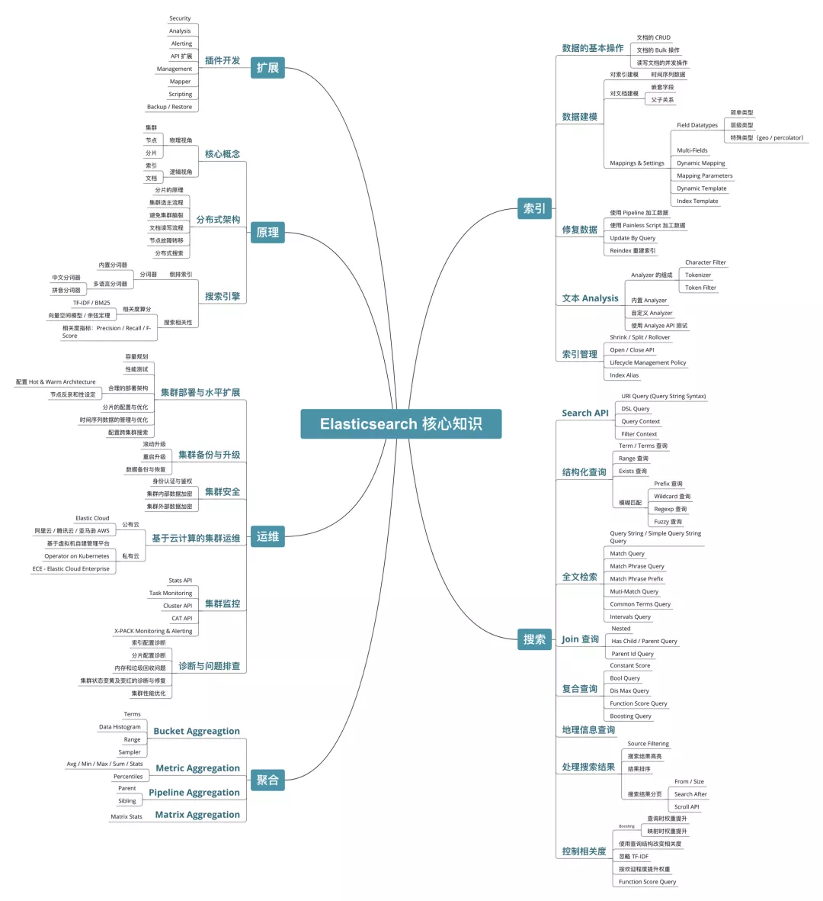
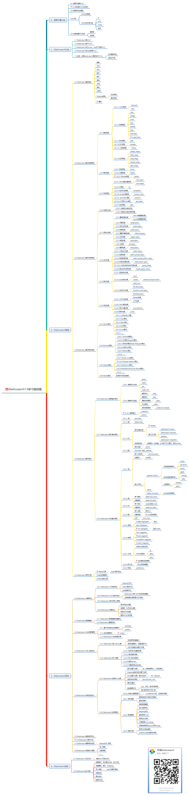

# ElasticSearch
- https://github.com/elastic/elasticsearch
- https://www.elastic.co/elasticsearch
- https://www.elastic.co/guide/en/elasticsearch/reference/current/index.html

## 基本概念
- 浅谈Elasticsearch的入门与实践 https://mp.weixin.qq.com/s/wlh2AHpNLrz9dHxPw9UrkQ

### 索引
- Full text queries https://www.elastic.co/guide/en/elasticsearch/reference/current/full-text-queries.html

- 正向索引
    
    ID → 内容
    
- 倒排索引（反向索引）
    
    词汇 → 在文档中的位置
    
    解释：被用来存储在全文搜索下某个单词在一个文档或者一组文档中的存储位置的映射。它是文档检索系统中最常用的数据结构。

## 最佳实践
### 查询
- https://www.elastic.co/guide/en/elasticsearch/reference/current/rest-apis.html
- https://www.elastic.co/guide/en/elasticsearch/reference/current/search-your-data.html
- https://www.elastic.co/guide/en/elasticsearch/reference/current/paginate-search-results.html
- https://stackoverflow.com/questions/68127892/how-does-search-after-work-in-elastic-search

### Best Practice
- 这些年背过的面试题——ES篇 https://mp.weixin.qq.com/s/dt_14etV_2ynAmyMa_uyug
- Elasticsearch 教程--入门 https://www.cnblogs.com/Wolfmanlq/p/5984376.html
- 腾讯
  - Elasticsearch 基础入门详文 https://mp.weixin.qq.com/s/GG_zrQlaiP2nfPOxzx_j9w
  - Elasticsearch核心应用场景-日志优化实践 https://mp.weixin.qq.com/s/smLLH8KnDdbPcOMhO0CMwg
  - 万字超全 ElasticSearch 监控指南 https://mp.weixin.qq.com/s/mO3TkKw3U9QZe_IoLV_Y_Q
- 滴滴
  - 探索ES高可用：滴滴自研跨数据中心复制技术详解 https://mp.weixin.qq.com/s/yNiEj8rjXCB20OuYdmf2zw
  - 解锁滴滴ES的性能潜力：JDK 17和ZGC的升级之路 https://mp.weixin.qq.com/s/PNTP_S65pniYV9RWhtowOw
  - 如何让ES低成本、高性能？滴滴落地ZSTD压缩算法的实践分享 https://mp.weixin.qq.com/s/nxDrq6b-QY5oJ6WDNYAFAA
  - Elasticsearch 在滴滴的应用与实践 https://mp.weixin.qq.com/s/nIYbtjzraQ9s-Lni24x42g

### Go client
- go-elasticsearch使用指南 https://www.liwenzhou.com/posts/Go/go-elasticsearch/
- Go Elasticsearch 查询快速入门 https://cloud.tencent.com/developer/article/1911255
- https://www.elastic.co/guide/en/elasticsearch/client/go-api/current/index.html
- https://github.com/elastic/go-elasticsearch
- https://pkg.go.dev/github.com/elastic/go-elasticsearch/esapi
- The Go client for Elasticsearch: Introduction https://www.elastic.co/blog/the-go-client-for-elasticsearch-introduction
- The Go client for Elasticsearch: Configuration and customization https://www.elastic.co/blog/the-go-client-for-elasticsearch-configuration-and-customization
- The Go client for Elasticsearch: Working with data https://www.elastic.co/blog/the-go-client-for-elasticsearch-working-with-data

### 同步
- mysql 数据同步 elasticsearch 方案 https://v2ex.com/t/922102
-

## 基本使用
### Docker 安装
docker 节点集群
- https://www.elastic.co/guide/en/elasticsearch/reference/current/docker.html
- https://gist.github.com/markheath/f246ec3aa5a3e7493991904e241a416a

docker 单节点
- https://medium.com/@TimvanBaarsen/how-to-run-an-elasticsearch-7-x-single-node-cluster-for-local-development-using-docker-compose-2b7ab73d8b82

### 本地集群

在开发机上运行多个 Elasticsearch 实例

`elasticsearch -E node.name=node0 -E cluster.name=geektime -E path.data=node0_data -d`

`elasticsearch -E node.name=node1 -E cluster.name=geektime -E path.data=node1_data -d`

`elasticsearch -E node.name=node2 -E cluster.name=geektime -E path.data=node2_data -d`

`elasticsearch -E node.name=node3 -E cluster.name=geektime -E path.data=node3_data -d`

查看集群节点

[http://localhost:9200/_cat/nodes](http://localhost:9200/_cat/nodes)

## 命令行工具

启动 Elasticsearch

`elasticsearch`

查看

http://localhost:9200/

查看插件

`elasticsearch-plugin list`

安装插件

`elasticsearch-plugin install analysis-icu`

## GUI 工具
### cerebro
Github
- https://github.com/lmenezes/cerebro

介绍
- web admin 管理工具

入口
- http://localhost:9000/

Ref
- https://www.redhat.com/sysadmin/cerebro-webui-elk-cluster

### dejavu
Github
- https://github.com/appbaseio/dejavu/

介绍
- web ui 工具
