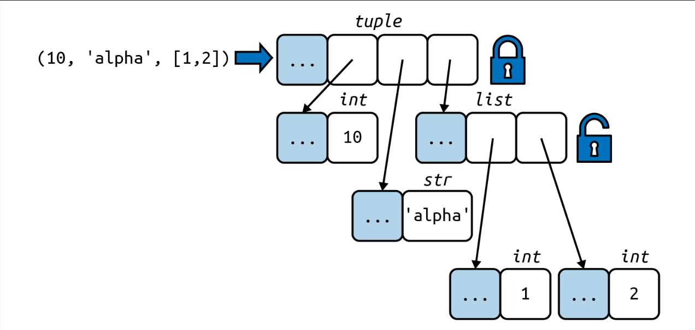
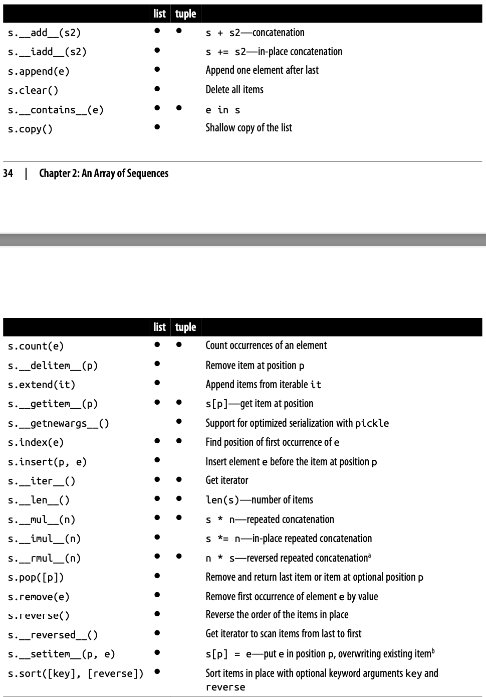

## Sequences
**Container sequences vs Flat sequences**

Container sequences
- Can hold items of different types, including nested containers.
- Some examples: list, tuple, and collections.deque.

Flat sequences
- Hold items of one simple type.
- Some examples: str, bytes, and array.array.

A container sequence holds references to the objects it contains, which may be of any type, while a flat sequence stores the value of its contents in its own memory space, not as distinct Python objects.
Thus, flat sequences are more compact, but they are limited to holding primitive machine values like bytes, integers, and floats.


Every Python object in memory has a header with metadata. The simplest Python object, a float, has a value field and two metadata fields:
- ob_refcnt: the object’s reference count
- ob_type: a pointer to the object’s type
- ob_fval: a C double holding the value of the float

On a 64-bit Python build, each of those fields takes 8 bytes. That’s why an array of floats is much more compact than a tuple of floats: the array is a single object holding the raw values of the floats, while the tuple consists of several objects—the tuple itself and each float object contained in it.

**Mutable sequences vs Immutable sequences**

Mutable sequences
- list
- bytesarray
- array.array
- collections.deque

Immutable sequences
- tuple
- str
- bytes

```
>>> from collections import abc
>>> issubclass(tuple, abc.Sequence)
True
>>> issubclass(list, abc.MutableSequence)
True
```


### List Comprehensions and Generator Expressions
**List Comprehensions and Readability**
Example 2-1. Build a list of Unicode code points from a string
```
>>> symbols = '$¢£¥€¤'
>>> codes = []
>>> for symbol in symbols:
...     codes.append(ord(symbol))
...
>>> codes
[36, 162, 163, 165, 8364, 164]

chars = []
for code in codes:
...    chars.append(chr(code))
...
>>> chars
['$', '¢', '£', '¥', '€', '¤']
```

Example 2-2. Build a list of Unicode code points from a string, using a listcomp
```
>>> symbols = '$¢£¥€¤'
>>> codes = [ord(symbol) for symbol in symbols] >>> codes
[36, 162, 163, 165, 8364, 164]
```

Summary
- A listcomp is more explicit. Its goal is always to build a new list.
- It is possible to abuse list comprehensions to write truly incomprehensible code.
  - If you are not doing something with the produced list, you should not use that syntax.
  - Also, try to keep it short. If the list comprehension spans more than two lines, it is probably best to break it apart or rewrite it as a plain old for loop.


Local Scope Within Comprehensions and Generator Expressions
```
>>> x = 'ABC'
>>> codes = [ord(x) for x in x]
>>> x
'ABC'
>>> codes
[65, 66, 67]
>>> codes = [last := ord(c) for c in x]
```
这里的 last 变量是通过 Generator Expressions 海象操作符（Walrus operator）赋值的，可以在外部访问；而 c 变量则是局部变量，只能在 listcomp 内部访问。 


**Listcomps Versus map and filter**
- Listcomps do everything the map and filter functions do, without the contortions of the functionally challenged Python lambda.
- Map and filter were faster than the equivalent listcomps, this is not true.

Example 2-3. The same list built by a listcomp and a map/filter composition
```
>>> symbols = '$¢£¥€¤'
>>> beyond_ascii = [ord(s) for s in symbols if ord(s) > 127]
>>> beyond_ascii
[162, 163, 165, 8364, 164]
>>> beyond_ascii = list(filter(lambda c: c > 127, map(ord, symbols))) >>> beyond_ascii
[162, 163, 165, 8364, 164]
```

**Cartesian Products**

Figure 2-3. The Cartesian product of 3 card ranks and 4 suits is a sequence of 12 pairings.
```
self._cards = [Card(rank, suit) for suit in self.suits
                                for rank in self.ranks]
```

Example 2-4. Cartesian product using a list comprehension
```
>>> colors = ['black', 'white']
>>> sizes = ['S', 'M', 'L']
>>> tshirts = [(color, size) for color in colors for size in sizes]
>>> tshirts
[('black', 'S'), ('black', 'M'), ('black', 'L'), ('white', 'S'),
('white', 'M'), ('white', 'L')]
```

**Generator Expressions**
- To initialize tuples, arrays, and other types of sequences, you could also start from a listcomp, but a genexp (generator expression) saves memory because it yields items one by one using the iterator protocol instead of building a whole list just to feed another constructor.
- Genexps use the same syntax as listcomps, but are enclosed in parentheses rather than brackets.

Example 2-5 shows basic usage of genexps to build a tuple and an array.
Example 2-5. Initializing a tuple and an array from a generator expression
```
>>> symbols = '$¢£¥€¤'
>>> tuple(ord(symbol) for symbol in symbols)
(36, 162, 163, 165, 8364, 164)
>>> import array
>>> array.array('I', (ord(symbol) for symbol in symbols)) array('I', [36, 162, 163, 165, 8364, 164])
```


### Tuples Are Not Just Immutable Lists
Tuples do double duty: they can be used as immutable lists and also as records with no field names.

**Tuples as Records**
Tuples hold records: each item in the tuple holds the data for one field, and the posi‐ tion of the item gives its meaning.
- Tuple like (10, 25)
- Record like { "x": 10, "y": 25 }

If you think of a tuple just as an immutable list, the quantity and the order of the items may or may not be important, depending on the context. But when using a tuple as a collection of fields, the number of items is usually fixed and their order is always important.

tuple unpacking
```
city, year, pop, chg, area =  ('Tokyo', 2003, 32_450, 0.66, 8014)
```


**Tuples as Immutable Lists**

The Python interpreter and standard library make extensive use of tuples as immuta‐ ble lists, and so should you. This brings two key benefits:
- Clarity
  - When you see a tuple in code, you know its length will never change.
- Performance
  - A tuple uses less memory than a list of the same length, and it allows Python to do some optimizations.

However, be aware that the immutability of a tuple only applies to the references contained in it. References in a tuple cannot be deleted or replaced. But if one of those references points to a mutable object, and that object is changed, then the value of the tuple changes.

Figure 2-4. The content of the tuple itself is immutable, but that only means the refer‐ ences held by the tuple will always point to the same objects. However, if one of the ref‐ erenced objects is mutable—like a list—its content may change.


[Are tuples more efficient than lists in Python?](https://stackoverflow.com/questions/68630/are-tuples-more-efficient-than-lists-in-python/22140115#22140115)
- To evaluate a tuple literal, the Python compiler generates bytecode for a tuple constant in one operation; but for a list literal, the generated bytecode pushes each element as a separate constant to the data stack, and then builds the list.
- Given a tuple t, tuple(t) simply returns a reference to the same t. There’s no need to copy. In contrast, given a list l, the list(l) constructor must create a new copy of l.
- Because of its fixed length, a tuple instance is allocated the exact memory space it needs. Instances of list, on the other hand, are allocated with room to spare, to amortize the cost of future appends.
- The references to the items in a tuple are stored in an array in the tuple struct, while a list holds a pointer to an array of references stored elsewhere. The indi‐ rection is necessary because when a list grows beyond the space currently alloca‐ ted, Python needs to reallocate the array of references to make room. The extra indirection makes CPU caches less effective.


**Comparing Tuple and List Methods**
When using a tuple as an immutable variation of list, it is good to know how similar their APIs are. As you can see in Table 2-1, tuple supports all list methods that do not involve adding or removing items, with one exception—tuple lacks the __reversed__ method. However, that is just for optimization; reversed(my_tuple) works without it.




### Unpacking Sequences and Iterables
Unpacking is important because it avoids unnecessary and error-prone use of indexes to extract elements from sequences. Also, unpacking works with any iterable object as the data source—including iterators, which don’t support index notation ([]).
```
>>> lax_coordinates = (33.9425, -118.408056)
>>> latitude, longitude = lax_coordinates # unpacking
```

**Using * to Grab Excess Items**

Defining function parameters with *args to grab arbitrary excess arguments is a classic Python feature.

In Python 3, this idea was extended to apply to parallel assignment as well:
```
>>> a, b, *rest = range(5)
>>> a, b, rest
(0, 1, [2, 3, 4])
>>> a, b, *rest = range(3)
>>> a, b, rest
(0, 1, [2])
>>> a, b, *rest = range(2)
>>> a, b, rest
(0, 1, [])
```

In the context of parallel assignment, the * prefix can be applied to exactly one vari‐ able, but it can appear in any position:
```
>>> a, *body, c, d = range(5) >>> a, body, c, d
(0, [1, 2], 3, 4)
>>> *head, b, c, d = range(5) >>> head, b, c, d
    ([0, 1], 2, 3, 4)
```

**Unpacking with * in Function Calls and Sequence Literals**

In function calls, we can use * multiple times:
```
>>> def fun(a, b, c, d, *rest):
...     return a, b, c, d, rest
...
>>> fun(*[1, 2], 3, *range(4, 7))
(1, 2, 3, 4, (5, 6))
```

The * can also be used when defining list, tuple, or set literals:
```
>>> *range(4), 4
(0, 1, 2, 3, 4)
>>> [*range(4), 4]
[0, 1, 2, 3, 4]
>>> {*range(4), 4, *(5, 6, 7)}
{0, 1, 2, 3, 4, 5, 6, 7}
```

**Nested Unpacking**

Example 2-8. Unpacking nested tuples to access the longitude
```
metro_areas = [
    ('Tokyo', 'JP', 36.933, (35.689722, 139.691667)),
    ('Delhi NCR', 'IN', 21.935, (28.613889, 77.208889)),
    ('Mexico City', 'MX', 20.142, (19.433333, -99.133333)),
    ('New York-Newark', 'US', 20.104, (40.808611, -74.020386)),
    ('São Paulo', 'BR', 19.649, (-23.547778, -46.635833)),
]

def main():
    print(f'{"":15} | {"latitude":>9} | {"longitude":>9}')
    for name, _, _, (lat, lon) in metro_areas:
        if lon<=0:
            print(f'{name:15} | {lat:9.4f} | {lon:9.4f}')

if __name__ == '__main__':
    main()
```


### Pattern Matching with Sequences
What’s New In Python 3.10
- https://docs.python.org/3.10/whatsnew/3.10.html#pep-634-structural-pattern-matching

Structural Pattern Matching:
- https://peps.python.org/pep-0622/
- https://peps.python.org/pep-0622/#backwards-compatibility
- Specification: https://peps.python.org/pep-0634/
- Motivation and Rationale: https://peps.python.org/pep-0634/
- Tutorial: https://peps.python.org/pep-0634/

Example 2-9. Method from an imaginary Robot class
```
def handle_command(self, message):
    match message:
        case ['BEEPER', frequency, times]:
            self.beep(times, frequency)
        case ['NECK', angle]:
            self.rotate_neck(angle)
        case ['LED', ident, intensity]:
            self.leds[ident].set_brightness(ident, intensity)
        case ['LED', ident, red, green, blue]:
            self.leds[ident].set_color(ident, red, green, blue)
        case _:
            raise InvalidCommand(message)
```

On the surface, match/case may look like the switch/case statement from the C lan‐ guage—but that’s only half the story. One key improvement of match over switch is destructuring—a more advanced form of unpacking.

Example 2-10. Destructuring nested tuples—requires Python ≥ 3.10
```
metro_areas = [
    ('Tokyo', 'JP', 36.933, (35.689722, 139.691667)),
    ('Delhi NCR', 'IN', 21.935, (28.613889, 77.208889)),
    ('Mexico City', 'MX', 20.142, (19.433333, -99.133333)),
    ('New York-Newark', 'US', 20.104, (40.808611, -74.020386)),
    ('São Paulo', 'BR', 19.649, (-23.547778, -46.635833)),
]

def main():
    print(f'{"":15} | {"latitude":>9} | {"longitude":>9}')
    for record in metro_areas:
        match record:
            case [name, _, _, (lat, lon)] if lon <= 0:
                print(f'{name:15} | {lat:9.4f} | {lon:9.4f}')
```

**Pattern Matching Sequences in an Interpreter**

使用 Python 的 match/case 实现一个解释器 - Lisp 的方言语言 Scheme 的解释器
- Alternative patterns for lambda
  - 用 match/case 实现 lambda 表达式
- Shortcut syntax for function definition
  - 用 match/case 实现函数定义的快捷语法


### Slicing
A common feature of list, tuple, str, and all sequence types in Python is the sup‐ port of slicing operations, which are more powerful than most people realize.

**Why Slices and Ranges Exclude the Last Item**

The Pythonic convention of excluding the last item in slices and ranges works well with the zero-based indexing used in Python, C, and many other languages. Some convenient features of the convention are:
- It’s easy to see the length of a slice or range when only the stop position is given: range(3) and my_list[:3] both produce three items.
- It’s easy to compute the length of a slice or range when start and stop are given: just subtract stop - start.
- It’s easy to split a sequence in two parts at any index x, without overlapping: sim‐ ply get my_list[:x] and my_list[x:].

**Slice Objects**

Python interprets slice notation
- `s[a:b:c]`
- `seq[start:stop:step]`

**Multidimensional Slicing and Ellipsis**

For example
```
if x is a four-dimensional array, x[i, ...] is a shortcut for x[i, :, :, :,]
```

**Assigning to Slices**

Few examples
```
>>> l = list(range(10))
>>> l
[0, 1, 2, 3, 4, 5, 6, 7, 8, 9]
>>> l[2:5] = [20, 30]
>>> l
[0, 1, 20, 30, 5, 6, 7, 8, 9]
>>> del l[5:7]
>>> l
[0, 1, 20, 30, 5, 8, 9]
>>> l[3::2] = [11, 22]
>>> l
[0, 1, 20, 11, 5, 22, 9]
>>> l[2:5] = 100
Traceback (most recent call last):
  File "<stdin>", line 1, in <module>
TypeError: can only assign an iterable
>>> l[2:5] = [100]
>>> l
    [0, 1, 100, 22, 9]
```
When the target of the assignment is a slice, the righthand side must be an itera‐ ble object, even if it has just one item.


### Using + and * with Sequences

Sequences support + and *. Usually both operands of + must be of the same sequence type, and neither of them is modified, but a new sequence of that same type is created as result of the concatenation.

```
>>> l1 = [1,2,3]
>>> l2 = [4,5]
>> l3 = l1 + l2
>> l3
[1, 2, 3, 4, 5]
```

To concatenate multiple copies of the same sequence, multiply it by an integer. Again, a new sequence is created:
```
>>>l=[1,2,3]
>>>l*5
[1, 2, 3, 1, 2, 3, 1, 2, 3, 1, 2, 3, 1, 2, 3] >>> 5 * 'abcd'
'abcdabcdabcdabcdabcd'
```

Both + and * always create a new object, and never change their operands.

**Building Lists of Lists**

Nested lists

Example 2-14. A list with three lists of length 3 can represent a tic-tac-toe board
```
>>> board = [['_'] * 3 for i in range(3)]
>>> board
[['_', '_', '_'], ['_', '_', '_'], ['_', '_', '_']]
>>> board[1][2] = 'X'
>>> board
[['_', '_', '_'], ['_', '_', 'X'], ['_', '_', '_']]
```

**Augmented Assignment with Sequences**

The augmented assignment operators += and *= behave quite differently, depending on the first operand.

**A += Assignment Puzzler**

Example 2-16. A riddle
```
>>>t=(1,2,[30,40])
>>> t[2] += [50, 60]
```

Example 2-17. The unexpected result: item t2 is changed and an exception is raised
```
>>> t = (1,2,[30,40])
>>> t[2] += [50, 60]
Traceback (most recent call last):
File "<stdin>", line 1, in <module>
TypeError: 'tuple' object does not support item assignment
>>> t
(1, 2, [30, 40, 50, 60])
```

原因
- Put the value of s[a] on TOS (Top Of Stack).
- Perform TOS += b. This succeeds if TOS refers to a mutable object (it’s a list, in Example 2-17).
- Assign s[a] = TOS. This fails if s is immutable (the t tuple in Example 2-17).

从上述问题得到的编码心得
- Avoid putting mutable items in tuples.
- Augmented assignment is not an atomic operation—we just saw it throwing an exception after doing part of its job.
- Inspecting Python bytecode is not too difficult, and can be helpful to see what is going on under the hood.


### list.sort Versus the sorted Built-In
The list.sort method sorts a list in place—that is, without making a copy. It returns None to remind us that it changes the receiver11 and does not create a new list. This is an important Python API convention: functions or methods that change an object in place should return None to make it clear to the caller that the receiver was changed, and no new object was created. Similar behavior can be seen, for example, in the ran dom.shuffle(s) function, which shuffles the mutable sequence s in place, and returns None.

In contrast, the built-in function sorted creates a new list and returns it. It accepts any iterable object as an argument, including immutable sequences and generators (see Chapter 17). Regardless of the type of iterable given to sorted, it always returns a newly created list.

Few examples
```
>>> fruits = ['grape', 'raspberry', 'apple', 'banana']
>>> sorted(fruits)
['apple', 'banana', 'grape', 'raspberry']
>>> fruits
['grape', 'raspberry', 'apple', 'banana']
>>> sorted(fruits, reverse=True) ['raspberry', 'grape', 'banana', 'apple']
>>> sorted(fruits, key=len)
['grape', 'apple', 'banana', 'raspberry']
>>> sorted(fruits, key=len, reverse=True)
['raspberry', 'banana', 'grape', 'apple']
>>> fruits
['grape', 'raspberry', 'apple', 'banana']
>>> fruits.sort()
>>> fruits
['apple', 'banana', 'grape', 'raspberry']
```


### When a List Is Not the Answer
Mutable sequence types that can replace lists in many cases.

**Array**

If a list only contains numbers, an array.array is a more efficient replacement.

array.tofile and array.fromfile are easy to use.

**Memory Views**

The built-in memoryview class is a shared-memory sequence type that lets you handle slices of arrays without copying bytes.

Using notation similar to the array module, the memoryview.cast method lets you change the way multiple bytes are read or written as units without moving bits around. memoryview.cast returns yet another memoryview object, always sharing the same memory.

**NumPy**

Advanced numeric processing in arrays.

NumPy & SciPy & Pandas

**Deques and Other Queues**

The class collections.deque is a thread-safe double-ended queue designed for fast inserting and removing from both ends.

Other Python standard library packages implement queues
- queue
- multiprocessing
- asyncio
- heapq
