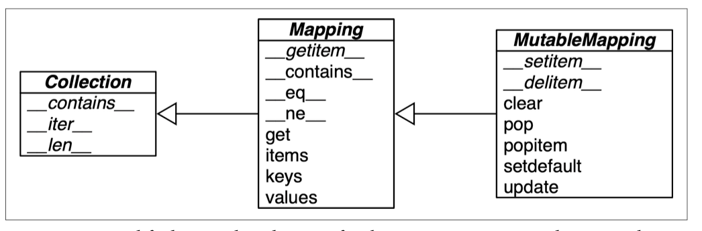
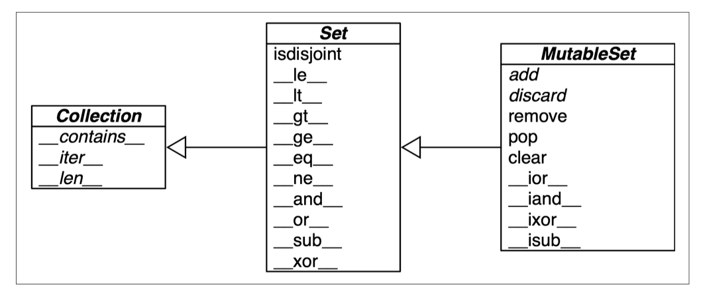
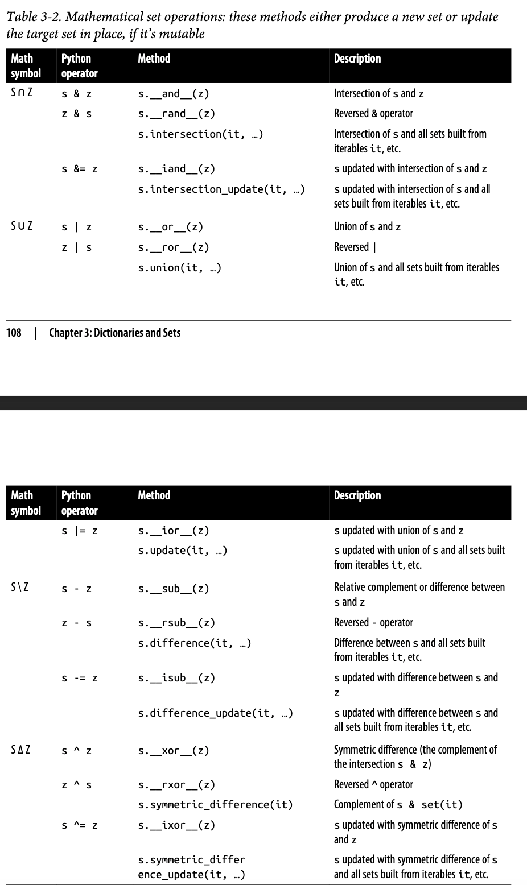
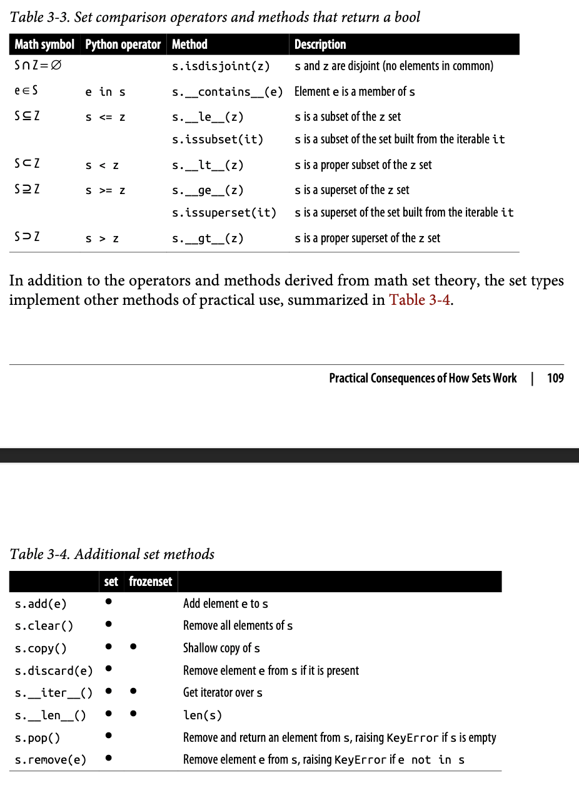
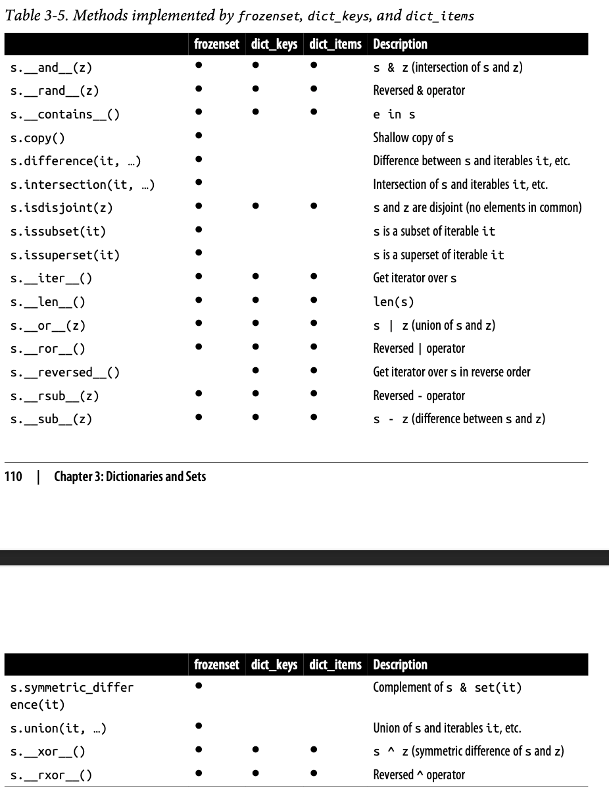

## Dictionaries and Sets
### Modern dict Syntax
**dict Comprehensions**
```
>>> dial_codes = [
... (880, 'Bangladesh'),
... (55, 'Brazil'),
... (86, 'China'),
... (91, 'India'),
... (62, 'Indonesia'),
... (81, 'Japan'),
... (234, 'Nigeria'),
... (92, 'Pakistan'), ... (7, 'Russia'),
... (1, 'United States'),
... ]
>>> country_dial = {country: code for code, country in dial_codes}
>>> country_dial
{'Bangladesh': 880, 'Brazil': 55, 'China': 86, 'India': 91, 'Indonesia': 62, 'Japan': 81, 'Nigeria': 234, 'Pakistan': 92, 'Russia': 7, 'United States': 1}
>>> {code: country.upper()
... for country, code in sorted(country_dial.items())
... if code < 70}
{55: 'BRAZIL', 62: 'INDONESIA', 7: 'RUSSIA', 1: 'UNITED STATES'}
```

**Unpacking Mappings**

```
def dump(**kwargs):
    return kwargs
>>> dump(**{'x': 1}, y=2, **{'z': 3}) {'x': 1, 'y': 2, 'z': 3}
{'x': 1, 'y': 2, 'z': 3}

** can be used inside a dict literal—also multiple times:
>>> {'a': 0, **{'x': 1}, 'y': 2, **{'z': 3, 'x': 4}}
{'a': 0, 'x': 4, 'y': 2, 'z': 3}
```

**Merging Mappings with |**
```
The | operator creates a new mapping:
>>> d1 = {'a': 1, 'b': 3}
>>> d2 = {'a': 2, 'b': 4, 'c': 6} >>>d1|d2
{'a': 2, 'b': 4, 'c': 6}
```

### Pattern Matching with Mappings
```
match {your_dict}:
case {'key1': 'value1', 'key2': 'value2'}:
    pass
```


### Standard API of Mapping Types
```
>>> my_dict = {}
>>> isinstance(my_dict, abc.Mapping)
True
>>> isinstance(my_dict, abc.MutableMapping)
True
```



**What Is Hashable**
> An object is hashable if it has a hash code which never changes during its lifetime (it needs a __hash__() method), and can be compared to other objects (it needs an __eq__() method). Hashable objects which compare equal must have the same hash code.

Numeric types and flat immutable types str and bytes are all hashable. Container types are hashable if they are immutable and all contained objects are also hashable. A frozenset is always hashable, because every element it contains must be hashable by definition. A tuple is hashable only if all its items are hashable.

The hash code of an object may be different depending on the version of Python, the machine architecture, and because of a salt added to the hash computation for secu‐ rity reasons. The hash code of a correctly implemented object is guaranteed to be constant only within one Python process.

**Overview of Common Mapping Methods**


**Inserting or Updating Mutable Values**

```
# this is ugly; coded like this to make a point
old_my_dict = my_dict.get(word, [])
old_my_dict.append(new_value)
my_dict[key] = old_my_dict

my_dict.setdefault(key, []).append(new_value)
等价于
if key not in my_dict:
    my_dict[key] = []
my_dict[key].append(new_value)
```


### Automatic Handling of Missing Keys
**defaultdict: Another Take on Missing Keys**

```
# using defaultdict instead of the setdefault method
my_dict[key].append(new_value)
```

**The __missing__ Method**

```
# The mechanism that makes defaultdict work by calling default_factory is the __missing__ special method.

# Tests for item retrieval using `d[key]` notation::
>>> d = StrKeyDict0([('2', 'two'), ('4', 'four')])
>>> d['2']
'two'
>>> d[4]
'four'
>>> d[1]
Traceback (most recent call last):
...
KeyError: '1'

# Tests for item retrieval using `d.get(key)` notation::
>>> d.get('2')
'two'
>>> d.get(4)
'four'
>>> d.get(1, 'N/A')
'N/A'

# Tests for the `in` operator::
>>>2 in d
True
>>>1 in d
False


# StrKeyDict0 converts nonstring keys to str on lookup
class StrKeyDict0(dict):
    def __missing__(self, key):
        if isinstance(key, str):
            raise KeyError(key)
        return self[str(key)]

    def get(self, key, default=None):
        try:
            return self[key]
        except KeyError:
            return default

    def __contains__(self, key):
        return key in self.keys() or str(key) in self.keys()
```

**Inconsistent Usage of __missing__ in the Standard Library**

__getitem__


## Variations of dict
**collections.OrderedDict**

**collections.ChainMap**

```
# The ChainMap instance does not copy the input mappings, but holds references to them. Updates or insertions to a ChainMap only affect the first input mapping.
>>> d1 = dict(a=1, b=3)
>>> d2 = dict(a=2, b=4, c=6)
>>> from collections import ChainMap
>>> chain = ChainMap(d1, d2)
>>> chain['a']
1
>>> chain['c']
6

>>> chain['c'] = -1
>>> d1
{'a': 1, 'b': 3, 'c': -1}
>>> d2
{'a': 2, 'b': 4, 'c': 6}


# Usage: basic rules of variable lookup in Python
import builtins
pylookup = ChainMap(locals(), globals(), vars(builtins))
```

**collections.Counter**

```
>>> ct = collections.Counter('abracadabra')
>>> ct
Counter({'a': 5, 'b': 2, 'r': 2, 'c': 1, 'd': 1})
>>> ct.update('aaaaazzz')
>>> ct
Counter({'a': 10, 'z': 3, 'b': 2, 'r': 2, 'c': 1, 'd': 1})
>>> ct.most_common(3)
[('a', 10), ('z', 3), ('b', 2)]
```

**shelve.Shelf**
- shelve — Python object persistence https://docs.python.org/3/library/shelve.html
- dbm — Interfaces to Unix "databases" https://docs.python.org/3/library/dbm.html
- pickle — Python object serialization https://docs.python.org/3/library/pickle.html

**Subclassing UserDict Instead of dict**

```
# Because UserDict extends abc.MutableMapping, the remaining methods that make StrKeyDict a full-fledged mapping are inherited from UserDict, MutableMapping, or Mapping. 
import collections
class StrKeyDict(collections.UserDict):
    def __missing__(self, key):
        if isinstance(key, str):
            raise KeyError(key)
        return self[str(key)]

    def __contains__(self, key):
        return str(key) in self.data

    def __setitem__(self, key, item):
        self.data[str(key)] = item
```


### Immutable Mappings
```
# MappingProxyType builds a read-only mappingproxy instance from a dict
>>> from types import MappingProxyType
>>> d = {1:'A'}
>>> d_proxy = MappingProxyType(d)
>>> d_proxy
mappingproxy({1: 'A'})
>>> d_proxy[1]
'A'
>>> d_proxy[2] = 'x'
Traceback (most recent call last):
  File "<stdin>", line 1, in <module>
TypeError: 'mappingproxy' object does not support item assignment
>>> d[2] = 'B'
>>> d_proxy
mappingproxy({1: 'A', 2: 'B'})
>>> d_proxy[2]
'B'
>>>
```


### Dictionary Views
The dict instance methods .keys(), .values(), and .items() return instances of classes called dict_keys, dict_values, and dict_items, respectively.

```
# The .values() method returns a view of the values in a dict
>>> d = dict(a=10, b=20, c=30) >>> values = d.values()
>>> values
dict_values([10, 20, 30])
>>> len(values)
3
>>> list(values)
[10, 20, 30]
>>> reversed(values)
<dict_reversevalueiterator object at 0x10e9e7310>
>>> values[0]
Traceback (most recent call last):
  File "<stdin>", line 1, in <module>
TypeError: 'dict_values' object is not subscriptable
```


### Practical Consequences of How dict Works
special attribute __dict__


### Set Theory
```
# A basic use case is removing duplication:
>>> l = ['spam', 'spam', 'eggs', 'spam', 'bacon', 'eggs']
>>> set(l)
{'eggs', 'spam', 'bacon'}
>>> list(set(l))
['eggs', 'spam', 'bacon']


# If you want to remove duplicates but also preserve the order of the first occurrence of each item, you can now use a plain dict to do it, like this:
>>> dict.fromkeys(l).keys()
dict_keys(['spam', 'eggs', 'bacon'])
>>> list(dict.fromkeys(l).keys())
['spam', 'eggs', 'bacon']
```

Set elements must be hashable. The set type is not hashable, so you can’t build a set with nested set instances. But frozenset is hashable, so you can have frozenset elements inside a set.

a | b returns their union, a & b computes the intersection, a - b the difference, and a ^ b the symmetric difference.

**Set Literals**
- The syntax of set literals—{1}, {1, 2}, etc.
- empty set set().

There is no special syntax to represent frozenset literals—they must be created by calling the constructor.
- `frozenset(range(10))`

**Set Comprehensions**

```
# Build a set of Latin-1 characters that have the word “SIGN” in their Unicode names
>>> from unicodedata import name
>>> {chr(i) for i in range(32, 256) if 'SIGN' in name(chr(i),'')}
{'§', '=', '¢', '#', '¤', '<', '¥', 'μ', '×', '$', '¶', '£', '©', '°', '+', '÷', '±', '>', '¬', '®', '%'}

```

### Set Operations







