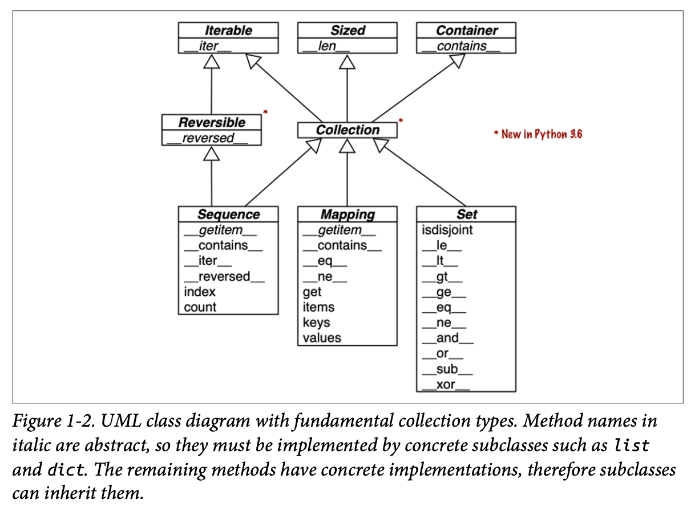
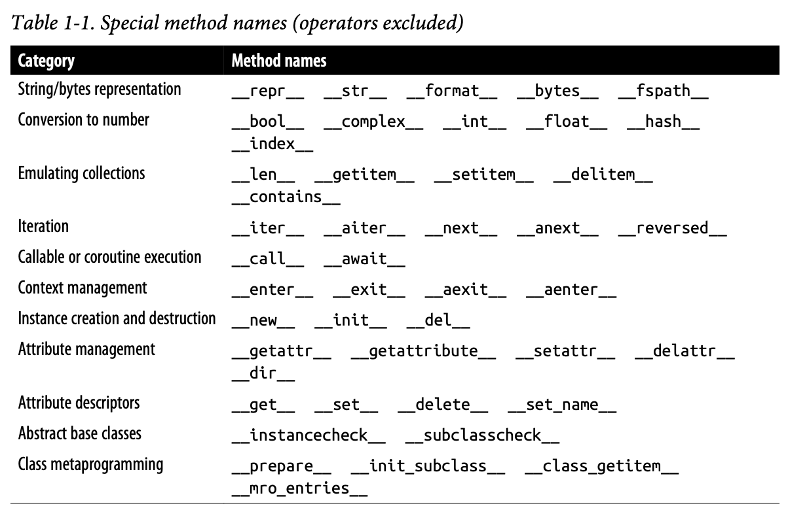
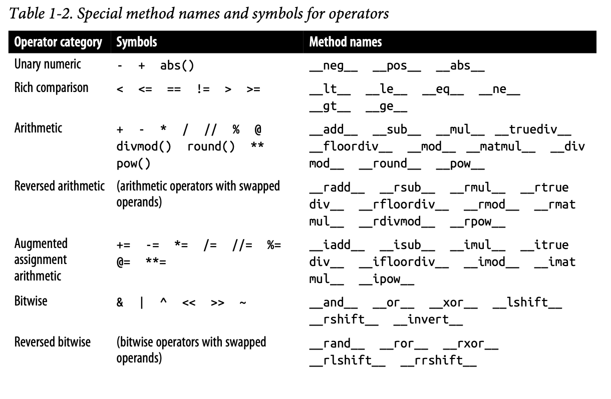
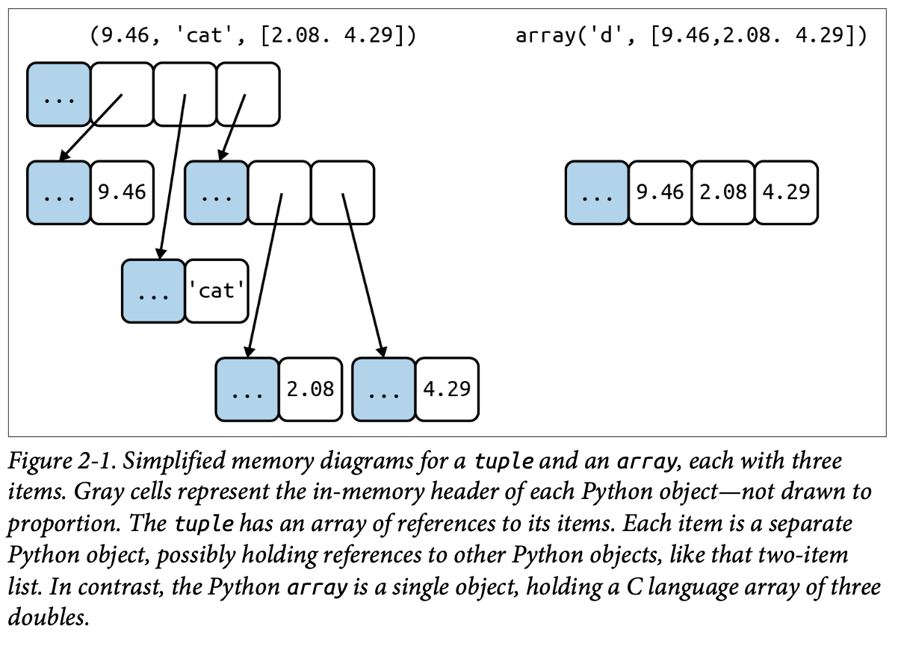
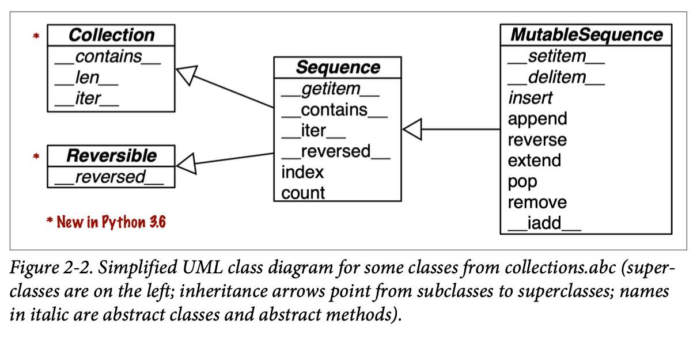

# Python Data Model
- https://docs.python.org/3/reference/datamodel.html
- https://en.wikipedia.org/wiki/Object_model

Python Data Model, 或者也可叫 Python object model.

Objects are Python’s abstraction for data. All data in a Python program is represented by objects or by relations between objects.

## 魔术方法或 special method
魔术方法由 Python 解释器执行

### 魔术方法 `__len__` 和 `__getitem__`

```
import collections
from random import choice

Card = collections.namedtuple('Card', ['rank', 'suit'])

class FrenchDeck:
    ranks = [str(n) for n in range(2, 11)] + list('JQKA')
    suits = 'spades diamonds clubs hearts'.split()
    
    def __init__(self):
        self._cards = [Card(rank, suit) for suit in self.suits
                                        for rank in self.ranks]

    def __len__(self):
        return len(self._cards)

    def __getitem__(self, position):
        return self._cards[position]
    
beer_card = Card('7', 'diamonds')
print(beer_card)

deck = FrenchDeck()
print(len(deck))

print(deck[0], deck[-1])

# random
print(choice(deck))


# 排序卡片
suit_values = dict(spades=3, hearts=2, diamonds=1, clubs=0)

def spades_high(card):
    rank_value = FrenchDeck.ranks.index(card.rank)
    return rank_value * len(suit_values) + suit_values[card.suit]

for card in sorted(deck, key=spades_high):
    print(card)
```

### 魔术方法 `__init__`
常见使用场景
- 在自己实现类的 __init__ 方法中去调用父类的 __init__ 方法


### 魔术方法 `__add__` 和 `__mul__`
用于数学计算


### 魔术方法 `__repr__`
用于对象的输出，与 `__str__` 相比更好


### 魔术方法 `__bool__`


## Collection API
module collections.abc 的 abstract base classes
- Iterable(Reversible), Sized, Containers
  - Iterable to support for, unpacking, and other forms of iteration
  - Sized to support the len built-in function
  - Container to support the in operator
- Collection
- Sequence, Mapping, Set
  - Sequence, formalizing the interface of built-ins like list and str
    - Only Sequence is Reversible, because sequences support arbitrary ordering of their contents, while mappings and sets do not.
  - Mapping, implemented by dict, collections.defaultdict, etc.
  - Set, the interface of the set and frozenset built-in types







### Sequences
**Container sequences vs Flat sequences**

Container sequences
- Can hold items of different types, including nested containers.
- Some examples: list, tuple, and collections.deque.

Flat sequences
- Hold items of one simple type.
- Some examples: str, bytes, and array.array.

A container sequence holds references to the objects it contains, which may be of any type, while a flat sequence stores the value of its contents in its own memory space, not as distinct Python objects.
Thus, flat sequences are more compact, but they are limited to holding primitive machine values like bytes, integers, and floats.



Every Python object in memory has a header with metadata. The simplest Python object, a float, has a value field and two metadata fields:
- ob_refcnt: the object’s reference count
- ob_type: a pointer to the object’s type
- ob_fval: a C double holding the value of the float

On a 64-bit Python build, each of those fields takes 8 bytes. That’s why an array of floats is much more compact than a tuple of floats: the array is a single object holding the raw values of the floats, while the tuple consists of several objects—the tuple itself and each float object contained in it.

**Mutable sequences vs Immutable sequences**

Mutable sequences
- list
- bytesarray
- array.array
- collections.deque

Immutable sequences
- tuple
- str
- bytes

```
>>> from collections import abc
>>> issubclass(tuple, abc.Sequence)
True
>>> issubclass(list, abc.MutableSequence)
True
```




