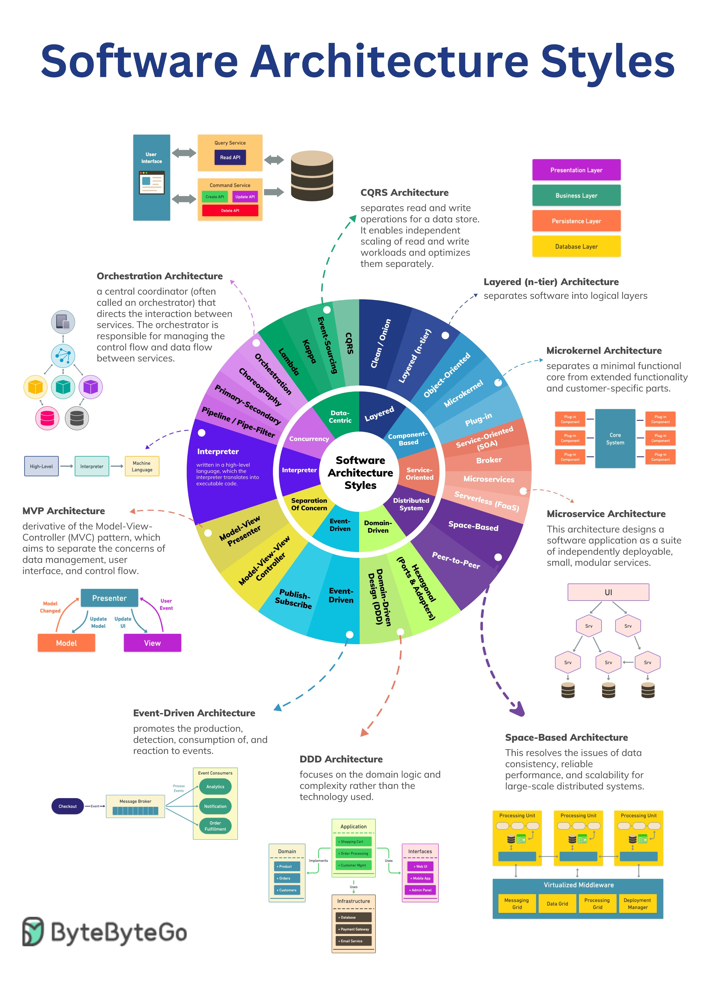

# 架构

## Best Practice

Best practice
- 架构之道——人人都是架构师 https://mp.weixin.qq.com/s/6A42588A8MYILG0OYMA0NA
- 后端开发架构 https://mp.weixin.qq.com/s/38X_DpCDp0keydzeoWG-yA
- 什么才是真正的架构设计？https://mp.weixin.qq.com/s/7_SU77SKgI-GLyjMZeavsQ
- 架构师必备底层逻辑：分层架构设计 https://mp.weixin.qq.com/s/t3tQbaAEAj-Uqclz0SSaMw
- 异地多活架构设计看这篇就够了 https://mp.weixin.qq.com/s/_P1-w-eMS0R2YR-WCT71gg
- 单元化架构在字节跳动的落地实践 https://mp.weixin.qq.com/s/ODogMQ0N6ppNjssRK_uD_A
- 为什么我的系统慢？“三大分离”架构上了吗？https://mp.weixin.qq.com/s/xjv-_OwkuD5OJ3LERoDQQg
- 究竟怎么做架构设计？https://mp.weixin.qq.com/s/0NJdnxvdkN16fXHW5byDAg
- 架构师之路：流量从10万到10亿，一定会遇到的80个架构问题 https://mp.weixin.qq.com/s/vVhLZDL6bRJL9u5GJg63tw

## 网站架构之路

演化之路:

1. 单台服务器搞定所有
2. 数据、文件服务分离
3. 缓存服务
4. 根据网络运营商来部署反向代理、CDN服务
5. 分布式方案
6. 使用NoSQL和搜索引擎
7. 业务拆分

结论:

1. 技术是根据业务来驱动的
2. 根据业务体量来决定使用哪些技术

常见思路：

基础(语法、常用函数、扩展等)

面向对象(抽象能力)

网站软件架构设计(设计模式、框架)

网站物理层架构设计(分布式、存储、负载均衡、高可用)

## 后端服务

## 分布式架构

### 多个节点

优点

- 容错性
- 可扩展性（性能）
- 固有分布性

### 消息传递

- 节点具有私有存储
- 易于开发
- 可扩展性（功能）
- 对比：并行计算

### 信息传递的方式

对外：REST

模块内部：RPC

模块之间：中间件，REST

## 微服务架构

### Restful 和 RPC 的区别

不同点:

restful 基于 http 动词，还是在 http 协议的基础上

rpc 则是基于 socket 层的，性能更好

相同点:

都是基于接口规范设计的
