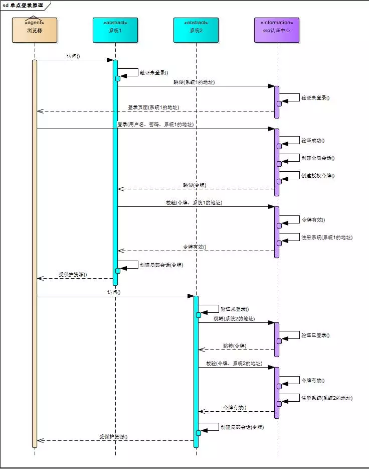

# API认证方式

1. 基础认证
    
    这种方式是直接将用户名和密码放到Header中，使用Authorization: Basic Zm9vOmJhcg==，使用最简单但是最不安全。
    
2. token 认证
    
    这种方式也是再HTTP头中，使用 Authorization: Bearer <token>，使用最广泛的TOKEN是JWT，通过签名过的TOKEN。
    
3. OAuth2.0
    
    这种方式安全等级最高，但是也是最复杂的。如果不是大型API平台或者需要给第三方APP使用的，没必要整这么复杂。
    

一般项目中的RESTful API使用JWT来做认证就足够了。

# JWT

客户端与服务端HTTP通信

HTTP通信三要素：

URL 通信的地址

Method 通信的方式

Params 通信的内容

HTTP请求

客户端传参方式：

url 和 request body 两种

get方法通过url

post方法

/post-form-urlencode

/post-form-data

/post-json

服务的获取参数方式：

$_GET 获取 get

$_POST 获取 form-urlencode 和 form-data

file_get_content('php://input') 获取 json

接口格式

三要素：

code、msg、data

### app接口的鉴权

传统的：

cookie 和 session

JWT方式：

服务端认证以后，生成一个JSON对象，返回给用户后续客户端所有的请求都会带上这个JSON对象，服务端依靠这个JSON来认定用户身份

JSON Web Token组成

- Header
- Payload
- Signature

header 通常包含了两部分：类型和采用的加密算法

{

"alg": "HS256",

"typ": "JWT"

}

### JWT 概念

1. jwt 介绍
- 明文字符串，通过 base64 简单处理
- 有过期时间，达到过期时间之前此 jwt token 一直是有效的
- 加密、解密的时候会使用私钥，由服务端保存，不能泄露

2. jwt token 组成
- HEADER:ALGORITHM & TOKEN TYPE
- PAYLOAD:DATA 即 Claim
- VERIFY SIGNATURE 即使用 algorithm 对 header 和 payload 的加密

3. jwt 使用
- /auth 接口生成 token 并返回，客户端存储
- 路由请求使用 auth middleware 解析 token 并验证，得到存放在 token 里的用户唯一标志（一般是 user_id）
- token 过期客户端重新进入登录页面进行登陆操作获取新的 token

4. jwt 泄露问题
- 使用 https 双向加密
- jwt 记录请求 ip，后续再根据 ip 加限制

PS：注意点
- 去中心化
    - token在服务端不做存储，生成后返回客户端，客户端每次请求服务端时，服务端校验请求header里的token是否合法。
    - 这样做的好处是省去了在服务端存储token的信息，也不用考虑集群的存储信息同步问题，缺点是token一旦生成，有效期内是不可更改的。

## OAuth

## SSO

