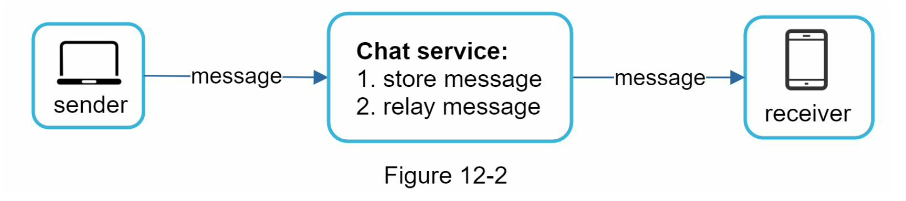
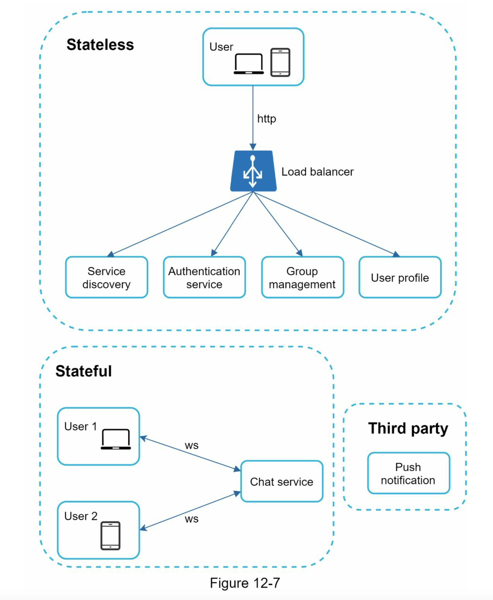
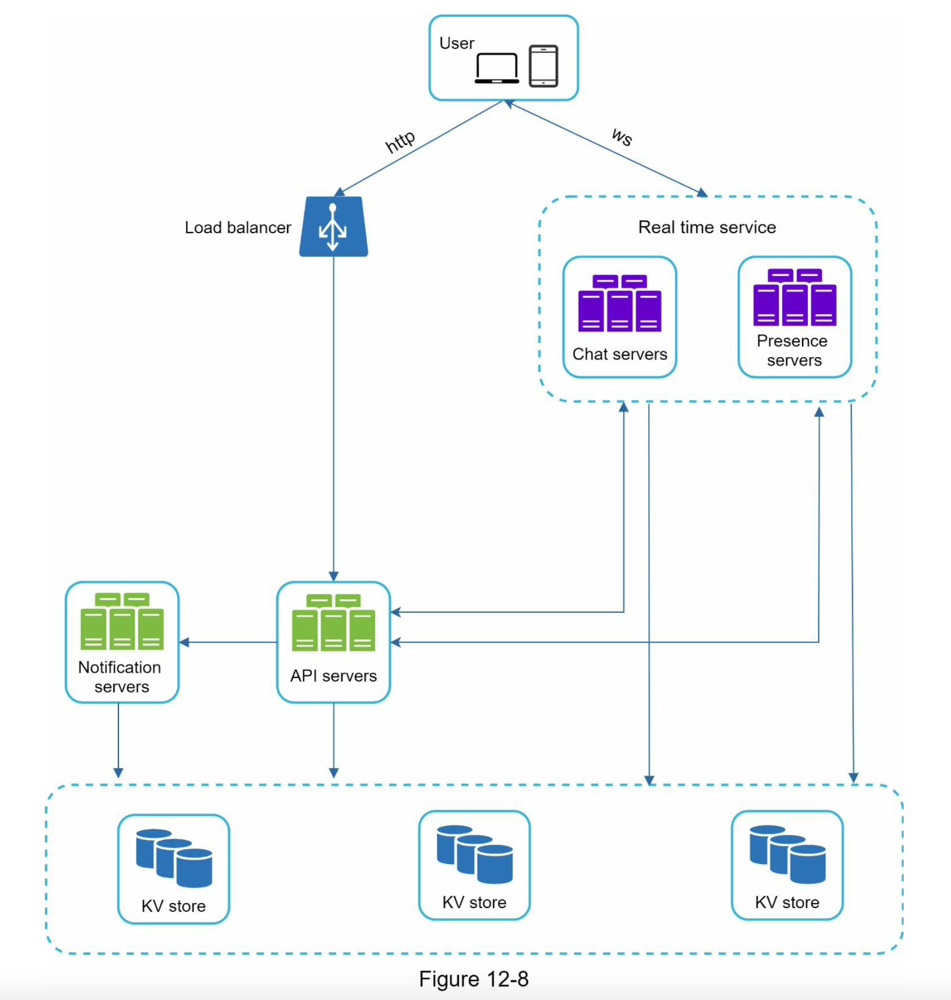
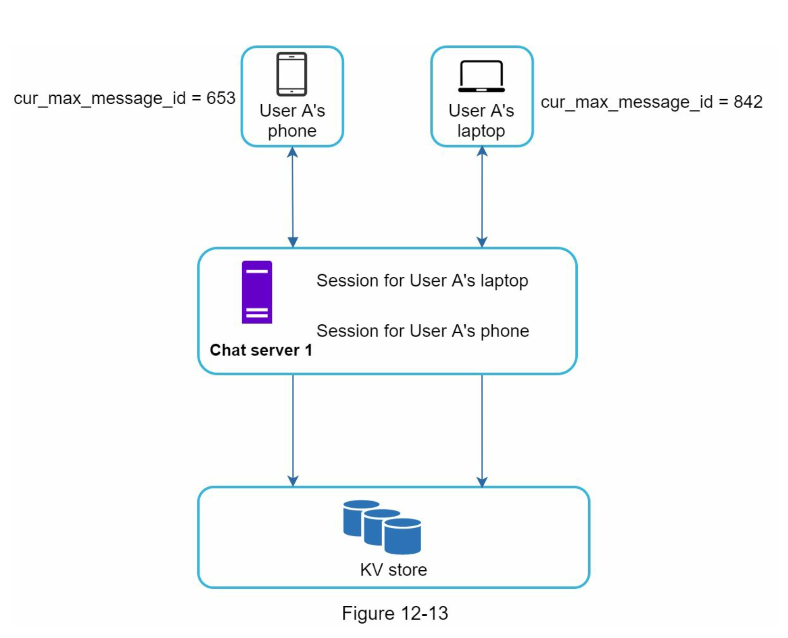
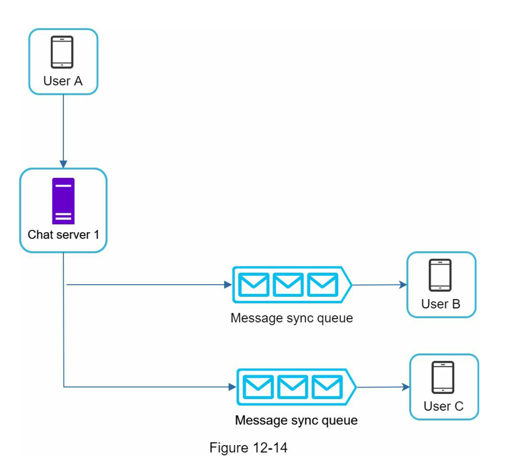
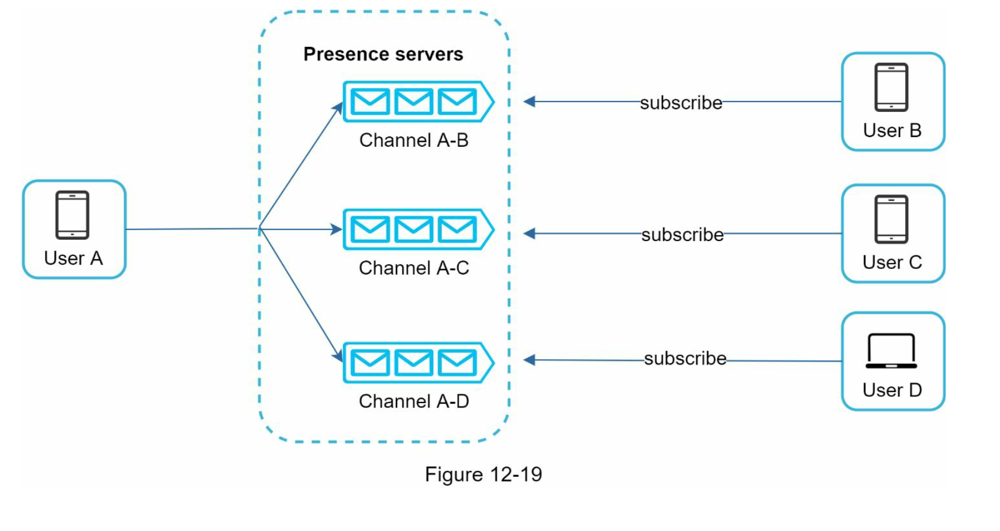

# Chat system
聊天系统

## 设计范围
- 聊天软件类型
  - 一对一聊天
  - 群聊
- 支持的端
  - 移动端
  - web 端
- 支持的体量
  - 日活千万
- 群聊成员数量限制
  - 最多 100 人
- 聊天软件的重要功能，是否支持附件
  - 一对一聊天、群聊、在线状态
  - 为了简化，聊天消息只包含文字
- 聊天消息大小限制
  - 不超过一万个字符
- 端到端之间需要加密吗
  - 为了简化先不考虑加密
- 聊天历史消息需要保持多久
  - 永久

## 通讯协议选择

### 聊天服务的基本功能
- 从其他客户端接收消息
- 为每条消息寻找正确的接收者，并把消息广播给它们
- 如果接收者不在线，那么服务器会一直存储消息直到接收者上线为止

### 聊天服务中常见的网络协议
轮询
  - 客户端不断周期性请求服务端，是否有新消息

长轮询
  - 客户端不断周期性请求服务端，服务端不会立即响应，需要等一段时间来获取是否有新消息进来，若请求超时则也重新请求
  - 优点：
    - 与普通轮询相比可以明显减少不必要的网络连接
  - 缺点：
    - 消息发送者和接收者可能不在同一个聊天服务器
    - 服务器不能哼好的通知客户端是否断连
    - 效率不高

WebSocket
  - WebSocket 可以很好的实现客户端和服务端的消息双向通讯

## 整体设计

### 聊天服务的需要考虑的几个重要部分
- 无状态服务 Stateless Services
  - 例如登陆、注册、用户信息等相关服务的管理
- 有状态服务 Stateful Service
  - 即聊天服务
- 第三方集成服务 Third-party integration
  - 例如消息通知服务
- 可伸缩性
  - 需随系统的体量变化做出相应的调整

### 聊天服务优化后的整体设计
- 聊天服务使消息的发送和接收更便利
- 在线服务管理上下线状态
- Api 服务处理用户操作相关的请求，例如登陆、注册、查看修改资料等
- 通知服务发送消息通知
- key-value 存储器存储历史聊天记录

### 存储媒介选择
- 非核心聊天服务选择用关系型数据库
- 核心聊天服务选择用 NoSQL 的 key-value 存储
- 聊天系统数据存储场景
  - 聊天数据量大
  - 只有最近的聊天记录才会被频繁访问
  - 需要支持随时查看某个时间点的历史记录
  - 在一对一聊天类型时读写比例是 1:1
- 理由
  - 容易水平扩容
  - 访问数据快
  - 关系型不能很好的处理长尾问题，索引越大访问数据越慢

### 数据模型设计
一对一消息聊天消息表设计（message）
- message_id    bigint
- message_from  bigint
- message_to    bigint
- content       text
- created_at    timestamp

群聊消息表设计（group_message）
- channel_id    bigint
- message_id    bigint
- user_id       bigint
- content       text
- created_at    timestamp

消息 ID 
- 要求
  - 必须唯一
  - 按时间先后的顺序增加
- 生成方式
  - global ID：分布式 ID 雪花算法
  - local ID：local 序列号生成器，适配每一个单聊或群聊，因为对于聊天系统 local ID 生成序列号方式足以支撑

## 细节设计
### 服务发现 Service discovery
- 作用：为客户端选择合适的聊天服务器（物理位置、容量、状态）进行通讯
- 实现：常见可以通过 Zookeeper 来实现
- 服务发现服务一般位于 API Server 层

### 消息流 Message flows

一对一消息流
- 1.用户 A 发送聊天消息给聊天服务器 1
- 2.聊天服务器 1 根据 ID 生成器生成消息 ID
- 3.聊天服务器 1 发送消息给消息同步队列
- 4.消息被存储到 key-value 存储
- 5.a 如果用户 B 在线，那么消息会被发送到聊天服务器 2，其已与用户 B 连接
- 5.b 如果用户 B 不在线，那么发送一个提醒到提醒服务器
- 6.聊天服务器 2 将消息发给用户 B，用户 B 和聊天服务器 2 之间有 Websocket 长连接

多个设备之间的消息同步
- 每个设备维护一个叫做 cur_max_message_id 的变量，用来记录此设备上的最新消息 ID
- 满足新消息判断的必要条件
  - 消息接收者 ID 和当前设备的登陆用户 ID 一致
  - key-value 存储中的消息 ID 要比此设备的 cur_max_message_id 要大

群聊消息流
- 为每个客户端接收者分配一个类似消息同步队列的收件箱，可以简化消息同步流程
- 当群聊成员少时，为每个客户端接收者存储多份消息拷贝成本也不高

### 在线状态 Online presence
- 用户登录
  - 客户端通过 API Server 来调用线状态服务器，并记录用户的在线状态和最后活跃时间
  - 客户端和在线状态服务器之间的连接，会记录用户的在线状态和最后活跃时间
- 用户登出
  - 客户端通过 API Server 来调用线状态服务器，并修改用户的在线状态
- 用户断连
  - 通过心跳机制来保证在线状态
  - 客户端周期性发送心跳请求，服务端判断单位时间内是否有心跳到达，如果没有则修改在线状态为下线

### 在线状态广播 Online status fanout
用户在线状态同步给其朋友的实现
- 当用户的状态发生改变，客户端发送事件到其绑定的在线服务 channel
- 在线服务维护多个 channel，消息接收者通过订阅 channel 来实现消息的接收
- 当群聊成员数量大时，发布订阅的方式会有性能限制，这时可能需要采用重新进群或手动刷新的方式来获取在线状态
  

## 总结：有待优化的点
- 考虑其他类型的消息，例如图片和视频
- 端到端消息加密
- 客户端消息缓存
- 优化客户端消息加载时间
- 错误处理
  - 当聊天服务器发生故障时，可以通过 Zookeeper 来实现服务发现，将请求分配到一个新的聊天服务器
  - 消息重发机制，例如常见的消息重发和排列技术

## 参考
- [System Design Interview](https://book.douban.com/subject/35246417/)
- [轮询、长轮询、Websocket 的区别](https://www.cnblogs.com/huchong/p/8595644.html)
- [WebSockets vs Long Polling](https://dev.to/kevburnsjr/websockets-vs-long-polling-3a0o)
- 微博网页端通过轮询收发消息，凭什么没有延时 https://mp.weixin.qq.com/s/-iVrf899zOjw0o2J2NEwgg
- 我们绝不存储用户聊天记录 https://mp.weixin.qq.com/s/Q-M86pLlav8TjfbryAchnA
- 微信：我绝不丢离线消息！https://mp.weixin.qq.com/s/XWUUGN0_atwEp1G1NpIa-g
- 微信：群消息，我们绝对不可能丢！https://mp.weixin.qq.com/s/dGKSP9llntzkp20X4TRnsQ
