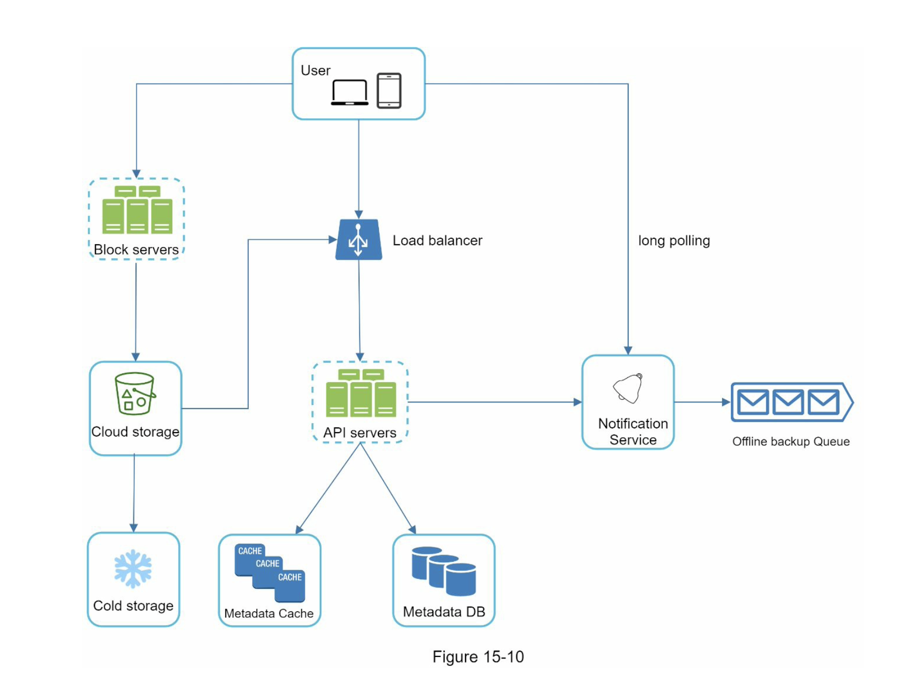
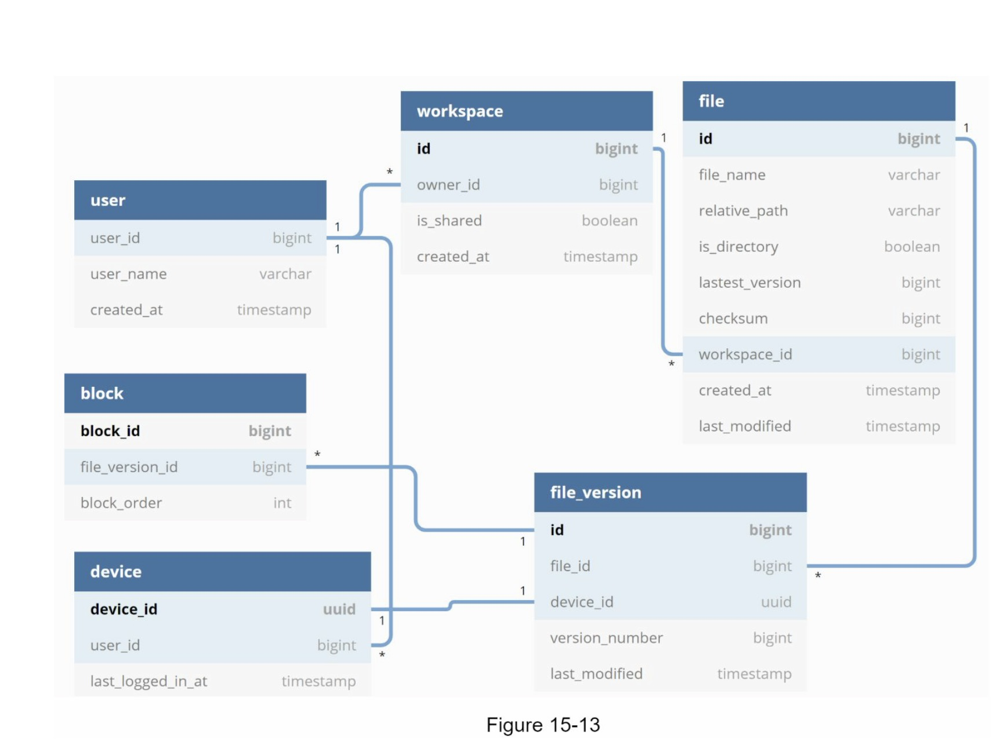

# Google Drive
Google Drive 网盘系统

## 设计范围
### 约束范围
- 最重要的功能
  - 上传和下载文件、文件同步、通知
- 支持的端
  - 移动App、web App
- 支持的文件格式
  - 所有文件类型
- 文件安全
  - 存储的文件必须要被加密
- 文件大小限制
  - 单个文件必须小于 10GB
- 支持的用户量级
  - 千万日活

### 系统核心功能要求
- 添加文件到 Google Drive
- 下载文件
- 跨端同步文件
- 文件历史版本
- 文件共享
- 文件变动时发送通知

### 系统核心非功能性要求
- 可靠性
  - 数据不能丢失
- 快速同步
- 带宽使用尽可能少
- 可伸缩
- 高可用

### 系统大致规模预估
- 假设有 5 千万注册用户和 1 千万日活用户
- 每个用户有 10GB 免费空间
- 假设每个用户每天上传 2 个文件，每个文件平均大小为 500 KB
- 用户读写比率为 1:1
- 那么总共需要存储空间：50 million * 10 GB = 500 Petabyte
- 上传 API 的 QPS 为：10 million * 2 uploads / 24 hours / 3600 seconds = ~ 240
- 峰值 QPS：QPS * 2 = 480

## 整体设计
系统的核心组件
- web server
  - 上传和下载文件
- database
  - 数据库用来记录元数据，例如用户数据、登录信息、文件信息等
- storage system
  - 用来存储文件

### API
- 上传文件到 Google Drive
  - 简单上传
    - 用于小文件上传
  - 断点续传
    - 用于大文件上传，因为可能会出现网络中断的场景
- 从 Google Drive 下载文件
- 文件历史版本

### 系统架构
- 负载均衡器
- Web 服务器
- 原数据存储到数据库
- 文件存储
  - 使用更高可用的云存储服务，例如 Amazon s3 和 aliyun 的 sso

### 文件同步冲突问题
对于网盘系统，多个用户编辑同一文件或多个设备编辑同一文件都可能造成文件同步冲突问题

### 系统大致设计

系统各个组件
- User
  - 浏览器或移动 App 用户
- Block servers
  - 用于将文件切分为一些小块文件，并将相关文件原信息存到 database，后续小块文件再被存到云存储服务 S3
- Cloud storage
  - 存储切分后的小块文件
- Load balancer
  - 将流量分发到不同的 API server
- API server
  - 管理用户认证、用户信息、文件修改的原信息
- Database
  - 存储元信息，例如用户、文件、块文件、修改记录等信息
- Cache
  - 缓存元信息
- 通知服务
  - 是一个发布/订阅系统，当文件被添加/修改/删除时，通知给其他不同的客户端设备，让它们拉取最新的文件
- Offline backup queue
  - 如果某个客户端处于断连状态，那么先将文件改变内容存到 backup 队列，待客户端恢复连接时再同步文件的改变内容

## 细节设计
### Block servers 文件块服务器
大文件修改尽可能使用更少的带宽
- 减少文件传输，将大文件切分为多个小文件，那么当修改文件时，就不需要发送整个文件到云存储
- Delta sync：只有被修改的块文件才需要被同步到云存储
- 压缩：文件压缩能减小文件大小
- 加密

### 高一致性
- cache 和 database 需保持数据一致性
- database 采用 RDMS，因为 RDMS 原生就支持 ACID

### metadata database 元数据库

database 用来记录一些元数据信息
- User
- Device
- Namespace
- file
- file version
- block

### upload flow 上传流程

上传流程分为两个步骤，可并发执行
- 添加文件元数据信息
- 上传文件到云存储

### download flow 下载流程

下载流程可以分为两种情况
- 当前其他客户端修改文件时，当前客户端在线
  - 通知系统直接通知当前客户端拉最新的文件
- 当前其他客户端修改文件时，当前客户端断连
  - 文件改变信息先存到缓存，当当前客户端再次上线时，再拉取最新的文件

### notification service 通知服务
提醒服务可以通过事件监听的方式将数据传送到客户端，事件监听主要有两种实现方式
- long polling 长轮询
- WebSocket

最终选择使用长轮询，因为通知服务对消息的传送并不频繁，且只需要从 server 到 client 这种半双工的通知消息，所以长轮询更适合这种场景；而 WebSocket 可能更适合聊天系统这种场景

### storage space 存储空间
减少存储花费的一些思路
- 相同数据文件块只存一份
  - 使用文件 hash 可以判断是否为相同文件
- 智能数据备份
  - 对文件历史保存版本做数量限制
  - 只保存有价值的历史文件版本，主要是避免短时间出现大量修改这种情况
- 数据冷热分离
  - 热数据及频繁被访问的文件还是存到云存储
  - 冷数据可以存到更低廉的存储设备

### failure handing 故障处理
可以归纳为以下几个方面
- 负载均衡器
  - 添加心跳探活机制
  - 如果出现故障则迁移到备份的新的负载均衡器
- Block server 故障
  - 将未完成或预处理状态提供给其他服务器
- 云存储故障
  - 切换不同的数据源中心获取文件数据
- API server 故障
  - 水平伸缩，重新导流到其他 API server
- Metadata cache 故障
  - 多节点部署
- Metadata Database 故障
  - 主从部署
- 通知系统故障
  - 长轮询出现故障断开，后续需重连
- 离线备份队列故障
  - 消费者重新订阅备份队列

## 总结
系统核心的点
- 强一致性
- 低网络带宽
- 快速同步

## 参考
- [System Design Interview](https://book.douban.com/subject/35246417/)
