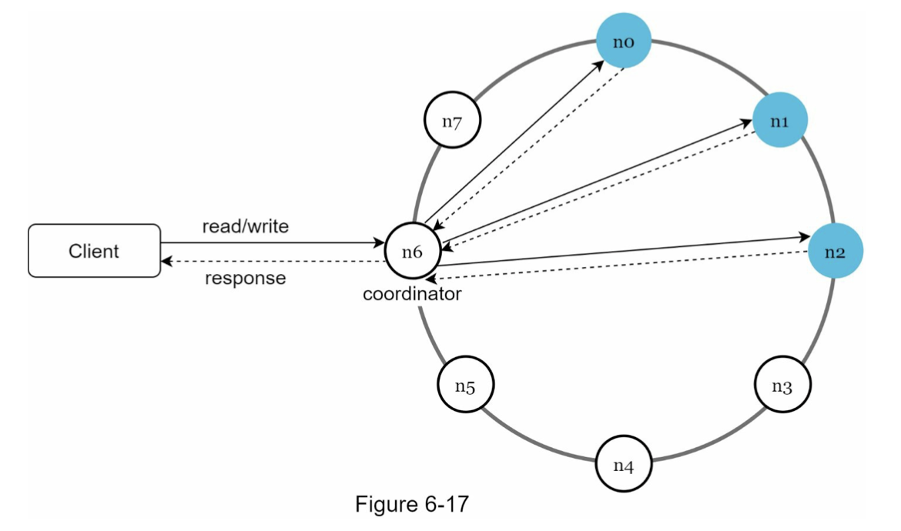

# Key-Value Store 键值存储

## 单服务器节点键值存储
单节点键值存储的方案可以使用 Hash table 将数据存储在内存中来实现。

由于单节点的内存空间有限，如果想尽可能存储更多的数据，还可以进行以下优化
- 数据压缩
- 数据冷热分离，只将频繁访问的数据存储在内存，其他的数据则存在磁盘

## 分布式键值存储
由于单节点服务器的空间有限，当大量数据需要存储时，就需要引入分布式键值存储（也叫做分布式哈希表），可以跨多个服务器存储键值对。

### 分布式 CAP 理论
CAP 理论表面分布式系统不能在下面三种特性中提供超过两种特性，但是由于 Partition Tolerance 一般在分布式系统中由于网络或者节点服务器硬件故障而不可避免，所以一般分布式 CAP 三选二的问题可以简化为在 Consistency 和 Avaliability 中二选一。
- Consistency 一致性
- Availability 可用性
- Partition Tolerance 分区容错性

适合 CP 的场景
- 例如银行系统，要求绝对的一致性来保证账户余额的正确性，但当指定数据在一个节点写的适合会阻塞其他节点读

适合 AP 的场景
- 例如 Redis，要求绝对的可用性来提供正常的服务（即使可能返回的是旧数据）

### 分布式键值存储的核心组件
- Data partition
- Data replication
- Consistency
- Inconsistency resolution
- Handing failures
- System architecture diagram
- Write path
- Read path

### Data partition
数据从单台节点存储改为多节点存储的挑战
- 数据需要跨多个节点并均匀的存储
- 当节点增加或删除时尽可能减少数据搬迁

可以使用一致性哈希来解决上述挑战，有如下优点
- 自动扩容：节点能随着负载的变化自动添加或删除
- 多样化：可以为不同配置的服务器节点分配不同的虚拟节点

### Data replication
为了实现高可用性和可依赖性，数据必须被复制存储在几个不同的服务器节点。可以通过 Hash ring 顺时针选择前 N 个节点作为数据备份的节点（这里 N 为副本数），此外由于虚拟节点的存在，可能导致映射的真实节点数小于 N，所以我们选择副本节点的时候需要按真实的节点进行选择

此外，为了防止一个数据中心的所有服务器节点出现物理故障（例如断电、自然灾害等），同时为了更可靠性需要将数据复制存储在不同地理位置的数据中心

### Consistency
既然数据被复制到多个节点，那么数据就必须要跨副本进行同步，Quorum 机制可以保证读写一致性。

Quorem 思想
- 考虑到分布式环境下网络分区现象是不可能消除的，甚至允许不再追求系统内所有节点在任何情况下的数据状态都一致，而是采用“少数服从多数”的原则，一旦系统中过半数的节点中完成了状态的转换，就认为数据的变化已经被正确地存储在系统当中，这样就可以容忍少数（通常是不超过半数）的节点失联，使得增加机器数量对系统整体的可用性变成是有益的，这种思想在分布式中被称为“Quorum 机制”。

一致性模型
- 强一致性：任何读操作返回的都是最新的数据，可能会出现并发阻塞，导致服务不可用
- 弱一致性：读操作可能取不到最新更新的数据
- 最终一致性：属于若一致性的特例，超过一定时间后，所有的更新都能被传达到，所有的副本最终都一致；大多数系统采取的模型，例如 Dynamo 和 Cassandra

### Inconsistency resolution: versioning
对于高可用性下出现的数据副本非一致性问题，可以通过版本和 vector lock 来解决

我们可以存储记录版本链并实现多版本记录管理来解决版本冲突，版本管理可通过 vector clock 来实现

针对引入 vector clock 可能带来的问题
- 会带来客户端使用的复杂性，因为需要实现冲突解决逻辑
- 版本链可能出现增长过快，导致长度太大，不利于管理

### Handing failures
**故障识别机制**

分布式系统中，如果一个节点说另一个节点发生故障了，系统就这样相信并进行后续处理，这样的逻辑是不对的，至少需要两个独立的节点来标记一个服务节点故障

去中心化节点故障识别机制的常见方法，例如 Gossip 协议，其工作原理如下
- 每个节点维护一个友邻节点列表，其包含数字 ID 和心跳计数器
- 每个节点周期的增加心跳计数
- 每个节点周期的发送心跳给其他随机节点集合
- 一旦节点收到心跳，则更新友邻节点最新信息
- 如果心跳在预定义时间内没有增加，那么就将对应的节点从友邻节点列表中下线

**处理临时故障**

通过 hinted handoff 来临时处理故障，当某个节点因为网络或服务器故障下线后，系统将分配给这个节点的流量重新分配到其他节点，待故障节点重启恢复后，先进行数据同步恢复副本的一致性，再将流量重新分配给恢复后的节点

**处理持久化故障**

如果节点因故障永久下线，节点中原先的数据需要重新分配，且尽可能最小化数据搬迁。可以参考[Merkle tree](https://en.wikipedia.org/wiki/Merkle_tree)

**处理数据中心故障**

针对单数据中心因为断网、断电、自然灾害等原因导致的故障，可以使用多数据中心来解决，不同数据中心之间有相同的数据副本。

### System architecture diagram
架构图

分布式键值存储架构应用的主要功能
- 客户端通过 API 与键值存储进行通信，例如 get(key), set(key, value)
- 协调者也是一个节点，它扮演客户端与键值存储之间的代理
- 节点分布在一个一致性哈希环上
- 系统完全去中心话，因此添加和删除节点都是自动的
- 数据被复制存储到多个节点
- 不存在单点故障问题，因为每个节点都有相同的职责

### Write path
节点写操作常见流程
- 写请求被持久化存储到提交日志文件
- 数据被保存在内存缓存
- 当内存缓存满了或达到预定义临界值，数据被刷新到磁盘 SSTable（a sorted-string table is a sorted list of key-value pairs）

### Read path
节点读操作流程
- 首先检查数据是否在内存，如果在则直接返回数据给客户端
- 如果数据不在内存，检查 bloom filter，bloom filter 被用来查看 SSTable 是否包含 key，从而避免磁盘操作
- 如果在 SSTable 中存在，则返回数据结果集到内存
- 最后返回结果集到客户端

## 参考
- [System Design Interview](https://book.douban.com/subject/35246417/)
- [CAP theorem](https://en.wikipedia.org/wiki/CAP_theorem)
- [Consistent Hashing](https://en.wikipedia.org/wiki/Consistent_hashing)
- [Quorum](https://en.wikipedia.org/wiki/Quorum_(distributed_computing))
- [分布式共识算法](https://icyfenix.cn/distribution/consensus)
- [Paxos](https://en.wikipedia.org/wiki/Paxos_(computer_science))
- [Raft](https://en.wikipedia.org/wiki/Raft_(algorithm))
- [Gossip protocol](http://icyfenix.cn/distribution/consensus/gossip.html)
- [Amazon DynamoDB](https://aws.amazon.com/dynamodb)
- [Memcached](https://github.com/memcached/memcached)
- [Redis](https://github.com/redis/redis)
- [极客兔兔：7天用Go从零实现分布式缓存GeeCache](https://geektutu.com/post/geecache.html)
