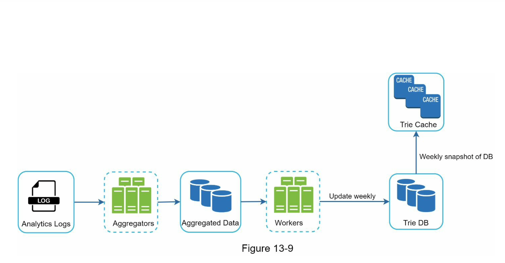

# Autocomplete system
自动补全系统

自动补全系统常见使用场景
- 浏览器搜索引擎，例如谷歌搜索
- 大型网站站内内容搜索引擎，例如亚马逊站内商品搜索引擎

## 设计范围
### 约束范围
- 搜索查询支持的匹配方式，只按前缀匹配还是支持中间位置匹配
  - 只支持前缀匹配
- 自动补全返回建议结果集的数量
  - 5 个
- 系统返回建议结果集的策略
  - 通过历史查询来生成受欢迎的结果集
- 系统需要支持单词拼写检查吗
  - 为了简化，不支持拼写检查和自动纠错
- 系统支持的语言
  - 为了简化，当前只支持用英语进行搜索
- 系统需要区分大小写字符和特殊字符吗
  - 为了简化，系统只支持英文字母且不区分大小写
- 产品使用用户量
  - 千万日活

### 系统核心要求
- 快速响应：用户搜索框输入内容后，系统需要尽可能快的响应搜索结果，大概在百毫秒左右
- 关联性：返回内容需要跟搜索输入有关联
- 有序性：结果集需要根据受欢迎程度或者其他排名模型进行排序
- 可伸缩性：系统能应对高流量请求场景
- 高可用：系统应该保证可用性和可访问性，及时在系统的部分功能下线、变慢或者其他不可预知的网络错误

### 系统大致规模预估
- 假设产品日活千万
- 平均每日每天搜索 10 次
- 每次查询字符串有 20 个字节
  - 假设输入的都是 acill 字符，即一个字符一个字节
  - 假设平均一个查询有 4 个单词，一个单词 5 个字符
  - 那么即每次查询字符串有 4 * 5 = 20 个字节
- 在搜索框每输入一个字符，客户端就给系统发送一个请求来获取自动补全数据；那么平均每次查询会发送 20 个请求
- 大致估算 QPS query per second
  - QPS：~24000 = 10,000,000 users * 10 queries / day * 20 characters / 24 hours / 3600 seconds
  - 峰值 QPS：QPS * 2 = ~48000
- 假设每日有 20% 的查询数据是新的（28定律），需要存储到我们的 dababase 中，那么每日消耗的增量存储空间有
  - 10 million * 10 queries / day * 20 byte per query * 20% = 0.4 GB.

## 整体设计
### 数据收集服务
目的：
收集用户查询数据，并实时聚合起来；这里数据集量如果很大的话，按实际性可以不做实时处理

简单实现：
搜索系统的数据聚合可以简化为用一个数据表，表里有 query 和 frequency 两个字段，存储用户的查询单词及查询频率

### 查询服务
目的：
提供一个搜索词或词的前缀，返回 5 个做高频的结果

简单实现：
- 假设已经有一个频率表，有两个字段，query 表示查询字符串，frequency 表示查询字符串已经被搜索的次数
- 那么当用户输入搜索字符前缀的时候，就可以按以下的 SQL 进行数据查询并返回结果给客户端
  - SELECT * FROM frequency_table WHERE query LIKE 'prefix%' ORDER BY freeuency LIMIT 5
- PS：此方案在数据量小时可以实现，但是当数据量大时就不可行

## 细节设计
### 基于整体设计的框架，可以进一步细分为下面几个部分
- 前缀树结构
- 数据收集服务
- 查询服务
- 可伸缩存储
- 前缀树支持的操作

### Trie 前缀树
- 存储结构
  - 基于关系型数据库存储的实现方式，对于查询 top 5 个搜索结果效率是不高效的，所以这时我们就需要 trie 这种数据结构，它常被用来解决前缀匹配问题
- 实现自定义前缀树的主要想法
  - 基于传统的前缀树实现方式，在每个节点上加上 weight 权重，表示当前节点所表示字符串前缀出现的频率
  - 那么获取 topk 个结果，则需要几个步骤
    - 找到目标前缀节点
    - 遍历前缀节点的所有子树，获取有效孩子节点
    - 按权重对孩子节点进行排序并返回 top k 个节点
- 优化
  - 上述存储结构在一些 corner case 下，获取 topk 结果需要遍历整个树，这是非常不高效的，所以可以有以下优化
  - 限制查询字符串前缀的最大长度，例如可以简单设置为 50
  - 缓存每个节点的 top k 搜索查询，可以尽可能避免遍历子树，加快客户端响应速度

### 数据收集服务
实时性
- 数据实时更新的方式不可行的原因
  - 用户可能每天输入几十亿次查询，每次查询就更新一次 trie 的方式会使查询服务性能急剧下降
  - trie 构建之后，每个节点的 topk 结果集可能不会经常变动，所以没必要太频繁更新 trie
- 搜索自动补全操作实时性要求不同场景
  - 对于 Twitter 这样的应用对实时推荐性要求高
  - 但是 google 搜索自动补全的场景对实时更新 trie 的要求不是特别高，一天不会更新很多次

数据收集流程
- 分析型日志
  - 存储搜索查询原始数据，日志是 append-only 追加文件方式存储的，且不被索引
- 聚合器
  - 将大数据量的日志数据按不同方式聚合成我们自己的格式化数据
  - 对于实时应用，我们可以聚合在短间隔时间内进行聚合
  - 对于其他应用，我们可以每周聚合一次数据
- 已聚合的格式化数据
  - 数据已经按一定格式存储到我们的 database 中
- 任务器
  - 任务器是一个周期性执行异方式同步数据到 trie 数据结构并存储到 DB 的服务器集合
- 缓存
  - 分布式缓存让 trie 可以在内存进行快速度，缓存每周从 DB 快照生成
- Trie DB
  - Trie DB 是持久性存储
  - 可以是文档型存储，例如 MongoDB，对数据序列化友好
  - 也可以是 key-value 型存，可以在 hash table 中表示
    - 每个前缀映射到一个 key
    - 每个节点映射到对应 value

### 查询服务
查询流程
- 搜索查询被发送到负载均衡器
- 负载均衡器路由请求到具体 API server
- API server 从缓存获取结构化自动补全数据，并返回给客户端
- 如果缓存不存在，API sever 会重新生成缓存数据到 Cache

查询服务用户体验优化，优化响应速度
- AJAX 异步处理请求
- 使用浏览器缓存
- 数据采样，因为数据量大会要更强大的数据处理能力和存储空间，我们可以每 N 次搜索请求才记一次日志

### Trie 操作
创建
- 由任务器根据已聚合的数据创建

更新
- 方式1：每周更新一次，用新的替换旧的
- 方式2：直接更新 trie 的指定节点
  - 更新一个节点时，该节点的所有祖先节点都需要被更新
  - 操作性能很差，但是当数据量小时可以接受

删除
- 通过过滤器暂存过滤规则，待下一次更新 trie 树时，再移除被标记的节点

### 扩容存储
水平分片扩容
- api server
- 分片管理器
- 分片存储服务器

## 总结：有待优化的点
- 支持多语言
  - 使用 Unicode 字符实现 trie 节点
- 不同国家的 top 搜索建议实现
  - 针对不同的国家，可以存储不同的 tries，并存储到相应的 CDN
- 怎样才能支持实时性搜索查询自动补全建议
  - 本文章实现的方案不支持实时搜索查询建议，因为
    - 离线任务器不能支持实时调度
    - 即使能被调度，生成一次 trie 的时间也会非常长
  - 要想实现实时性，有几点思路
    - 通过分片减少工作数据集
    - 调整搜索排名模型，并给最近搜索查询分配更多的权重
    - 可以通过数据流工具来处理数据，因为数据可以连续的被生成，比如 MapReduce、Spark、Storm、Kafka 等

## 参考
- [System Design Interview](https://book.douban.com/subject/35246417/)
- [Trie](https://en.wikipedia.org/wiki/Trie)
