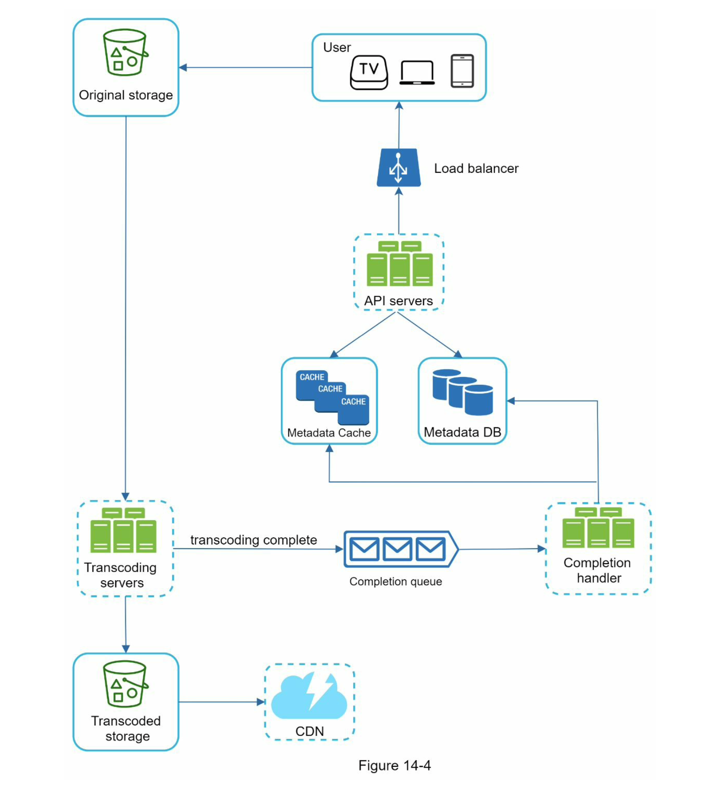
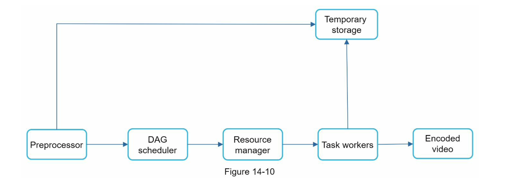

# Youtube
Youtube 视频系统

## 设计范围
### 系统核心要求
- 最核心的功能
  - 上传和观看视频
- 需要支持的客户端
  - 移动 App，Web 浏览器，智能电视
- 日活用户
  - 五百万
- 用户每日使用时间
  - 30分钟
- 国际化
- 支持的视频格式
  - 需支持绝大多数视频格式
- 安全
  - 需要被加密
- 视频文件大小限制
  - 单个视频不能超过 1GB
- 是否能利用云基础设施
  - 可以使用第三方云存储来提高效率

### 系统大致规模预估
- 假设产品日活 5 百万
- 每个用户每天观看 5 个视频
- 每天有 5% 的用户会上传 1 个视频
- 假设每个视频平均有 300MB
- 那么每天需要的存储空间：5 million * 10% * 300 MB = 150TB
- CDN 花费
  - 假设云 CDN 的流量花费是每 GB 需 $0.02
  - 那么每天 CDN 视频流需要花费：5 million * 5 videos * 0.3GB * $0.02 = $150,000

## 整体设计
系统可以大致分为三个部分
- Client
- CDN
  - 视频存储在 CDN，当播放视频的时候，视频数据从 CDN 以流的方式传过来
- API server
  - 信息推荐
  - 生成视频上传 URL
  - 更新原数据到 database 和 cache
  - 用户相关操作

### API server
API server 有两个核心的流程
- 视频上传流程
- 视频播放流程

视频上传
- User
  - 用户在不同客户端观看视频，比如电脑，手机等
- Load balancer
  - 将请求分发到不同 API server
- API severs
  - 处理大部分的用户请求，除了视频流
- Metadata DB
  - 元数据数据库
- Metadata cache
  - 元数据缓存
- Original storage
  - 原始存储，是存储原始视频文件的对象存储系统
- Transcoding servers
  - 转码服务器，将原始视频转化成不同格式的视频文件，以便在不同的设备上能播放
- Transcoded storage
  - 存储转码后的视频文件
- CDN
  - 转码后的 视频文件被缓存在 CDN，当播放视频的时候视频流就会从 CDN 传送到客户端
- Completion queue
  - 转码操作完成队列，存储视频转码完成的事件
- Completion handler
  -  转码处理器从转码完成队列获取到事件，然后去 metadata db 和 cache 修改相应的视频元数据信息

视频上传还可以细分为两个过程，它们可并行处理
- 上传真实视频
- 更新元数据

视频播放
- 播放方式
  - 与完整文件下载后再播放不同，视频流播放是连续下载视频分段的方式进行播放
- [流协议](https://en.wikipedia.org/wiki/Real_Time_Streaming_Protocol)

## 细节设计
### 视频转码
视频转码的必要性
- 原始视频一般太耗存储空间
- 许多设备和浏览器只支持特定的视频格式
- 确保客户端能用更少的带宽观看更高质量的视频
- 需要根据客户端不同的网络情况，提供不同质量的视频，以提升用户体验

### Directed acyclic graph (DAG) model
因为视频转码需要昂贵的计算代价且耗时，所以 DAG 是为了支撑不同视频处理流水线，并维持高并发处理所提出来的。

同一个视频可能被执行的任务
- 视频检查
- 视频编码
- 添加缩略图
- 添加水印呢

### 视频转码架构

转码架构
- Preprocessor 预处理器
  - 视频切分
  - 对老设备不支持视频切分做兼容
  - 生成 DAG
  - 缓存数据
- DAG scheduler 调度器
  - 调度不同的任务发送到 resource manager 中的任务队列
- Resource manager 资源管理器
  - Task queue：是一个优先队列，包含需要被调度的任务
  - Worker queue：是一个优先队列，包含 worker 相关信息
  - Running queue：包含正在运行的 task 和 worker
  - Task schedule：获取 task/worker 去执行相应的 job
- Task workers
  - 执行在 DAG 中被定义的任务
- Temporary storage 临时存储
  - 存储转码过程中的视频文件，转码完成后即释放掉
- Encoded video
  - 编码视频，将视频编码为指定的视频格式

### 系统优化
- 速度优化
  - 并行视频上传过程
  - 将视频上传到离用户更近的数据中心
  - 其他各个可以被并行操作的流程
- 安全优化
  - 获取预签名 URL 上传链接
    - 将视频上传到正确的位置
  - 数据保护
    - 数字版权
    - 视频加密
    - 可视化水印
- 存储花费优化
  - 只在 CDN 存热门的视频
  - 非热门视频不需要存储太多的编码后视频
  - 按区域分发不同的热门视频
  - 搭建私有的 CDN

### 错误处理
两种错误类型
- 可恢复性错误
  - 针对这种错误，可以使用重试机制
- 不可恢复性错误
  - 针对这种错误，直接返回给客户端相应的错误码

常见错误的处理方式
- 上传错误：重试
- 视频切分错误
- 转码错误
- 预处理器错误
- DAG 调度器错误
- 资源管理器故障
- Task worker 故障
- API server 故障
- 元数据 DB 和 Cache 服务器故障

## 总结：有待优化的点
- API 服务器水平扩容
- Database 数据分片
- 实时直播流支持
- 视频内容审核

## 参考
- [System Design Interview](https://book.douban.com/subject/35246417/)
- [Real Time Streaming Protocol](https://en.wikipedia.org/wiki/Real_Time_Streaming_Protocol)
